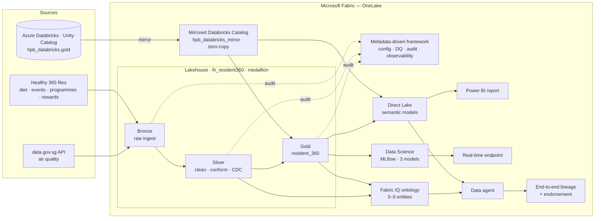

# HPB × Microsoft Fabric (+ Azure Databricks) — Full-Day Hands-On Workshop
## "Building a Resident 360 that makes Healthy 365 smarter — Fabric and Databricks, better together"

Over one day your team builds a **Resident 360 view** on Microsoft Fabric using the data behind HPB's flagship
**Healthy 365** app — while your existing estate stays in **Azure Databricks**. Every lab makes the Healthy 365
experience better for a real resident, and each layer builds on the one before.

> **Audience:** data engineers / analysts / data scientists who use Azure Databricks today.
> **Goal:** do what you do in Databricks, *in Fabric* — and see how the two coexist — with each step tied to a
> tangible improvement in the resident's app experience.

---

### Meet Rahim — why each lab matters

> **Rahim, 61, Woodlands.** He joined the **National Steps Challenge** but is drifting: he walks some days,
> rarely logs meals, skips outdoor events on hazy days, and dropped out of a programme. His last **health
> screening** flagged elevated glucose. Today Healthy 365 mostly "sees" his steps. Across the day we give the
> platform the layers it needs to understand Rahim, keep his data fresh and reliable, personalise his nudges in
> real time, and let HPB ask questions about residents like him.

```
Lab 0  Base Camp                 → the ground it all stands on
Lab 1  Build the Resident 360    → unify the estate + transform + observe at scale
Lab 2  Govern & Trace            → governed, observable, traceable by design
Lab 3  Nudges That Land          → proactive, personalised, real-time (ML)
Lab 4  Just Ask                  → explainable, conversational, ontology-powered
```
**The arc in four words:** *Unify → Govern → Personalise → Converse.*

---

### The scenario

Healthy 365 captures **daily steps, MVPA, sleep, heart rate, SpO₂**, plus **meal logs**, **event bookings**,
**challenges** (National Steps Challenge, Eat Drink Shop Healthy), **programmes** (Healthier SG, I Quit),
**Healthpoints & eVouchers**, and **health-screening** results (Screen for Life). Today it's engineered in
Databricks. We bring it together in Fabric:



*All data is **synthetic** (no real residents / PII). Resident IDs (`RESIDENT_00001`…`RESIDENT_01500`) are
shared across Databricks and the Fabric uploads so every join works.*

> **Note:** Each lab's README opens with a **"Where this fits"** diagram showing the slice it builds and how it extends the
> previous lab toward this full architecture.

---

### Agenda (10:00 – 17:30, 1-hour lunch)

| Time | Duration | Session |
|------|----------|---------|
| 10:00–10:15 | 15 min | Arrival & settle |
| 10:15–10:55 | 40 min | **Microsoft Fabric & Databricks — Better Together** |
| 10:55–11:30 | 35 min | Workshop logistics & environment check |
| 11:30–12:30 | 60 min | 🍱 Early lunch |
| 12:30–14:00 | 90 min | **Lab 1 · Build the Resident 360** — medallion end-to-end (mirror + ingest + Bronze→Silver→Gold in one Lakehouse), Data Wrangler, Copilot, semantic model + Copilot-built report; Spark UI, resource prioritisation & monitoring woven in |
| 14:00–14:10 | 10 min | ☕ Break |
| 14:10–14:40 | 30 min | **Metadata-Driven Lakehouse — Concepts & Architecture** |
| 14:40–15:40 | 60 min | **Lab 2 · Govern & Trace** — governed, observable, traceable transforms + DQ over the medallion |
| 15:40–16:25 | 45 min | **Lab 3 · Nudges That Land** — 3-model ML pipeline + tuning + MLflow → real-time endpoint |
| 16:25–16:35 | 10 min | ☕ Break |
| 16:35–17:20 | 45 min | **Lab 4 · Just Ask** — notebook-generated ontology → data agent; semantic-model vs ontology comparison |
| 17:20–17:30 | 10 min | Wrap-up & next steps |

### How the HPB focus areas are covered
1. **Data lineage** (Databricks → Power BI): Lab 1 (intro) + Lab 4 (end-to-end capstone)
2. **Batch orchestration with conditional triage**: Lab 1 (in-notebook DQ gate) + Lab 2 (metadata-driven, config-driven orchestration & scheduling)
3. **Spark UI & cluster monitoring**: Lab 1 (woven into the transformation runs)
4. **Concurrent ETL + ad-hoc, resource prioritisation**: Lab 1 (custom pool / Autoscale Billing for Spark)
5. **Common DE features** (schema evolution, CDC, upsert, time travel, Spark config): Lab 1
6. **Data quality & traceability** (DQ rules, run observability, lineage of transforms): Lab 2 (metadata-driven framework)

---

### Folder map

| Folder | Lab | What's inside |
|--------|-----|---------------|
| [`lab0-prerequisites/`](lab0-prerequisites/README.md) | **Base Camp** | Accounts, login + download |
| [`lab1-build-resident360/`](lab1-build-resident360/README.md) | **Build the Resident 360** | `data/` (upload files) · `notebooks/` (one end-to-end medallion notebook) — mirror, ingest, Bronze→Silver→Gold, Data Wrangler, Copilot, semantic model + report |
| [`lab2-metadata-lakehouse/`](lab2-metadata-lakehouse/README.md) | **Govern & Trace** | Metadata-driven framework integrated onto your medallion — config, orchestration, DQ, observability & traceability |
| [`lab3-datascience-ml/`](lab3-datascience-ml/README.md) | **Nudges That Land** | `notebooks/` (train + tune models, call endpoint) |
| [`lab4-ontology-dataagent/`](lab4-ontology-dataagent/README.md) | **Just Ask** | `notebooks/` (generate the ontology from data) · `assets/` (agent questions) |

**Everything runs in the browser** — all code executes inside Fabric or Databricks notebooks. Start at
**[Lab 0 · Base Camp](lab0-prerequisites/README.md)**.

> **Get the kit:** click the green **`< > Code`** button above → **Download ZIP** (or
> `git clone https://github.com/stellistic/resident-360-data-workshop.git`). Browse the labs right here on
> GitHub, or open the folder in VS Code — each lab is a `README.md` you read top to bottom.

> **Before any notebook:** attach the **`lh_resident360`** Lakehouse, and name your mirror exactly
> **`hpb_databricks_mirror`** so the kit notebooks work unchanged.
> **Fell behind?** Ask the facilitator for the current recovery point. Lab 2 and Lab 4 depend on the
> **Silver** tables as well as `gold.resident_360`; a Gold-only catch-up is only safe after your Silver tables exist.

---

### Data
All data is **synthetic** — no real residents or personal data (PII). The seven Fabric upload files contain
64,573 records total (63,073 excluding the 1,500-row resident reference file) and include May 2026 dates; the separate Databricks activity table used in the mirror has the
intentional May activity gap explored during the workshop. Regional PSI is a context proxy for haze exposure,
not an individual exposure or health measurement.
