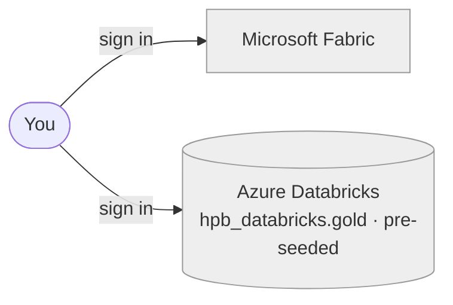
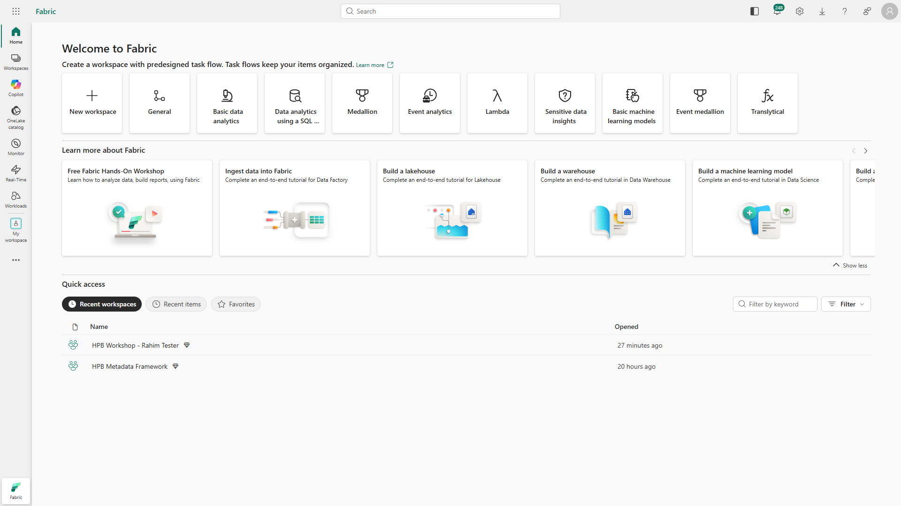
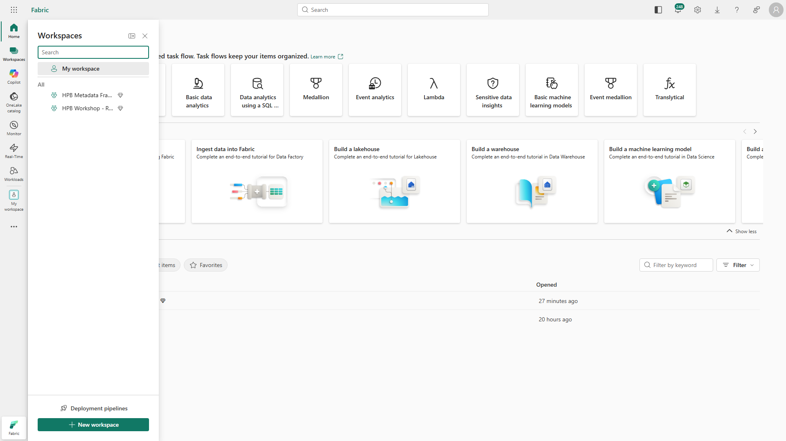
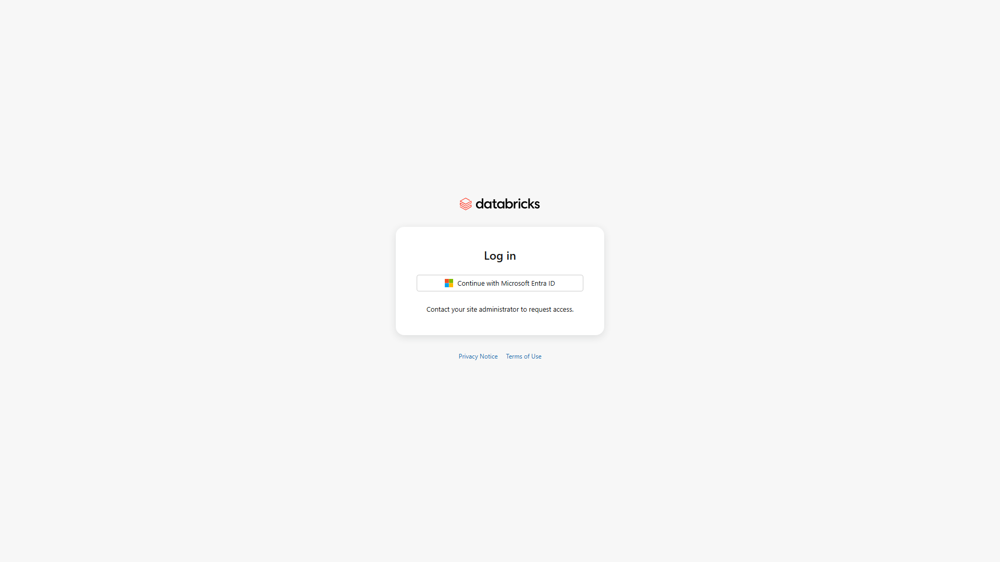
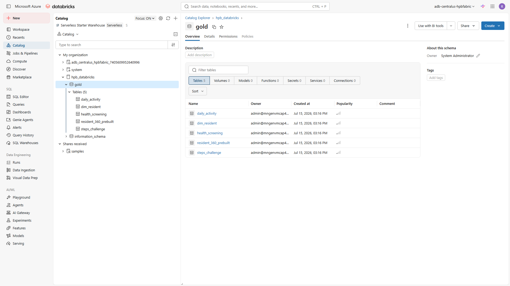
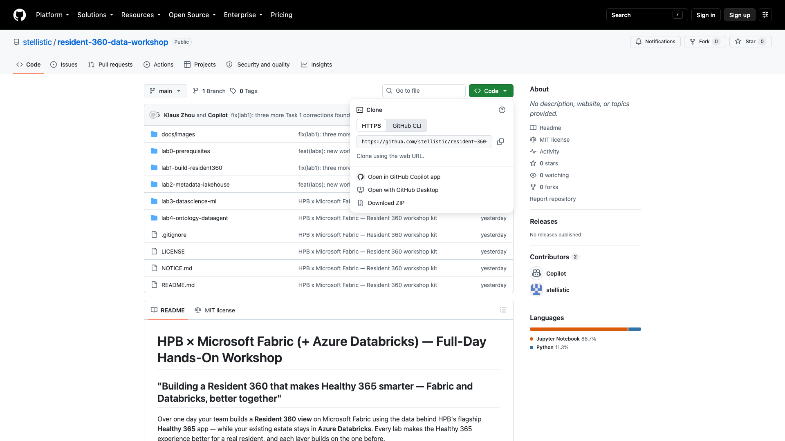

[← Workshop home](../README.md)

# Lab 0 · Base Camp
## Welcome & environment setup

**⏱ 15 min**  ·  **🎯 Focus:** sign in, get the kit

### The story
Nothing for Rahim yet — this is the ground everything else stands on. Both environments start empty; you build
every workload yourself in the labs that follow.

### You'll build
- A working sign-in to **Microsoft Fabric** and the shared **Azure Databricks** workspace.
- The workshop kit downloaded and ready.

### Where this fits



Foundation only — you start building the pipeline in Lab 1.

---

### Task 1 — Sign in to Microsoft Fabric
1. Open **https://app.fabric.microsoft.com** and sign in with your workshop credentials.
2. Complete MFA / password reset if prompted.

   

3. Left nav → **Workspaces** → open your assigned workspace **`HPB Resident 360 (<your username>)`** and work there.
   Your username is the part of your sign-in before the `@` — so `kaydenzhou@…` gets `HPB Resident 360 (kaydenzhou)`.

   

> **Note:** First sign-in places you in **My workspace** with a free licence — that's expected. Do your lab work in your
> assigned workshop workspace, which sits on the Fabric capacity.

### Task 2 — Sign in to Azure Databricks
1. Open the shared Databricks URL (your facilitator provides it) and sign in with **Continue with Microsoft Entra ID**
   (same workshop account).

   

2. Open **Catalog** and confirm the shared estate catalog **`hpb_databricks`** is present (the facilitator
   seeded it once for the room). Expand its **`gold`** schema to see the seeded tables. You'll mirror it in Lab 1 —
   you don't run anything here.

   

### Task 3 — Get the kit
Get the workshop kit from GitHub — either option works:

- **Download ZIP (no tools needed):** open **https://github.com/stellistic/resident-360-data-workshop**,
  click the green **`< > Code`** button → **Download ZIP**, then unzip it.
- **Or clone with git:**
  ```bash
  git clone https://github.com/stellistic/resident-360-data-workshop.git
  ```



Open the top-level **`README.md`** (in your browser on GitHub, or locally in VS Code) and follow the labs in order.

---

### ✅ Checkpoint
- [ ] Signed in to Fabric (in your workshop workspace) and to Azure Databricks
- [ ] `hpb_databricks` catalog visible in Databricks
- [ ] Kit downloaded

---

### Next up
**[Lab 1 · Build the Resident 360](../lab1-build-resident360/README.md)**
