[← Workshop home](../README.md)

# Lab 1 · Build the Resident 360
## Medallion end-to-end — mirror, ingest, transform, observe

**⏱ 90 min**  ·  **🎯 Focus:** #1 lineage (intro) · #2 orchestration · #3 Spark UI · #4 resource prioritisation · #5 DE features

### The story
Rahim's steps live in **Databricks**; his meals, events, programmes, rewards and the day's air quality are scattered
across app files and a public API. Today you bring it **all together in Fabric** — without moving the Databricks
estate — into a single **Resident 360** view, and you watch how Spark builds it. The API's regional PSI value is a
haze-context proxy, not a resident-level exposure or clinical signal.

### You'll build
- One **Lakehouse** (`lh_resident360`) with three schemas — **`bronze` → `silver` → `gold`**.
- A **zero-copy mirror** of the shared Databricks estate (`hpb_databricks_mirror`).
- The full medallion in **one well-documented notebook**: ingest app files + a live API → Bronze, clean → Silver,
  join with the mirror → **`gold.resident_360`** — trying **Data Wrangler** and **Copilot agent mode** along the way.
- A Direct Lake **semantic model** (`sm_resident360`, over gold + silver) and a **Copilot-generated report**.
- Hands-on **Spark UI, resource prioritisation and monitoring** while your jobs run.

### Where this fits

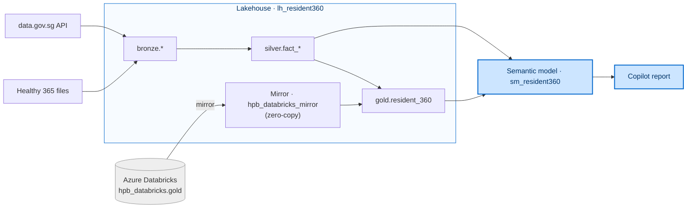
```mermaid
flowchart LR
  DBX[("Azure Databricks<br/>hpb_databricks.gold")]
  FILES["Healthy 365 files"]
  API["data.gov.sg API"]
  subgraph LH["Lakehouse · lh_resident360"]
    MIR["Mirror · hpb_databricks_mirror<br/>(zero-copy)"]
    BRZ["bronze.*"]
    SLV["silver.fact_*"]
    GLD["gold.resident_360"]
  end
  SM["Semantic model · sm_resident360"]
  RPT["Copilot report"]
  DBX -->|mirror| MIR
  FILES --> BRZ
  API --> BRZ
  BRZ --> SLV --> GLD
  MIR --> GLD
  GLD --> SM
  SLV --> SM
  SM --> RPT
  style LH fill:#f7fbff,stroke:#0066cc,color:#003366
  classDef item fill:#cce5ff,stroke:#0066cc,stroke-width:2px,color:#003366;
  class SM,RPT item;
  classDef done fill:#eeeeee,stroke:#999999,color:#333333;
  class DBX done;
```

**Builds on:** the pre-seeded Databricks estate. Everything in Labs 2–4 extends the medallion you build here.

### Files
- `data/` — the seven Healthy 365 files you upload to the Lakehouse.
- [`notebooks/resident360_medallion.ipynb`](notebooks/resident360_medallion.ipynb) — the **one** end-to-end notebook (Bronze → Silver → Gold + observability).

### Notebook-created object names
Use these names exactly when checking notebook output or building downstream items:

- Bronze uploaded-file tables: `bronze.h365_residents_reference`, `bronze.h365_meal_logs`,
  `bronze.h365_event_bookings`, `bronze.h365_programme_enrolments`, `bronze.h365_rewards`,
  `bronze.h365_evoucher_redemptions`, `bronze.h365_challenges`.
- Bronze API table: `bronze.env_air_quality`.
- Silver analytic facts: `silver.fact_meal_log`, `silver.fact_event_attendance`,
  `silver.fact_programme_enrolment`, `silver.fact_rewards`, `silver.fact_evoucher_redemption`,
  `silver.fact_challenge`.
- Silver Lab 4 helpers: `silver.dim_event_occurrence`, `silver.map_resident_event_attendance`.
- Gold table: `gold.resident_360`.

> **New to Fabric?** Every screen is pictured below. If a button hides behind a **⋯ (More options)** menu or the
> window feels cramped, **maximise your browser** — Fabric hides ribbon buttons on narrow windows.

---

### Task 1 — Workspace, Lakehouse & mirror the Databricks estate

**A Lakehouse** is the storage container for all your tables; **mirroring** brings the Databricks `gold` tables into
Fabric with **zero copies** (Fabric reads them live).

1. Open your assigned workspace **`HPB Resident 360 (<your username>)`**. On the toolbar click **+ New item**.

   > **Note:** the first time you open your workspace, a dialog titled **"Introducing task flows"** appears over
   > the whole page. Click **Got it** to dismiss it — **+ New item** is behind it and cannot be clicked until you
   > do. A "predesigned task flow" panel then remains at the top of the list; ignore that one. Everything in this
   > lab starts from the **+ New item** button on the toolbar.

   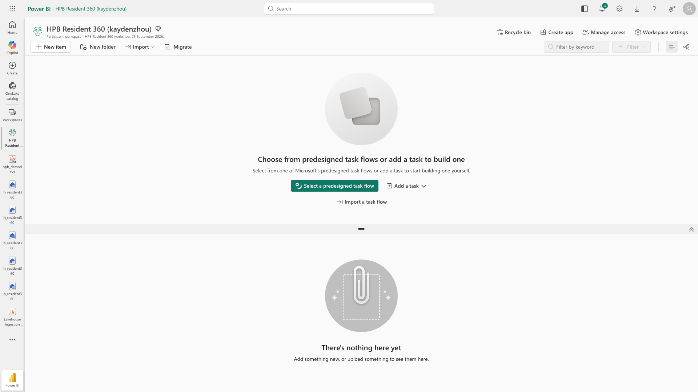

2. In the panel, search `lakehouse` and click the **Lakehouse** tile.

   > **A second first-run pop-up appears here.** Inside the New item panel, a teaching callout titled
   > **"Add to favorites" (1 of 2)** appears over the tiles with a dimmed backdrop. Like the task-flows dialog,
   > it *blocks clicks on the tiles underneath* — a tile will look perfectly normal and simply not respond.
   > Click **Next** through both callouts, or **×** to close. It appears once per account, so you will not see
   > it again after Task 1.
   >
   > Also note the panel has **its own** *Filter by keyword* box on the right. Typing into the Fabric search bar
   > at the very top of the page instead returns *"No results found"* — that bar searches your content, not
   > item types.

   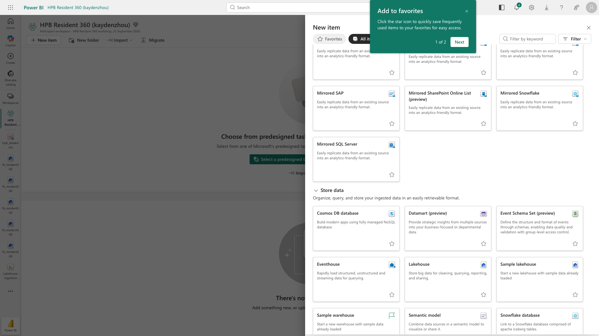

3. Name it **`lh_resident360`**, keep **Lakehouse schemas** checked, click **Create**.

   > ⚠️ **Do not uncheck Lakehouse schemas.** This choice is irreversible after creation. If it is unchecked, the
   > Lakehouse must be rebuilt from scratch and you will not be able to continue mid-workshop.

   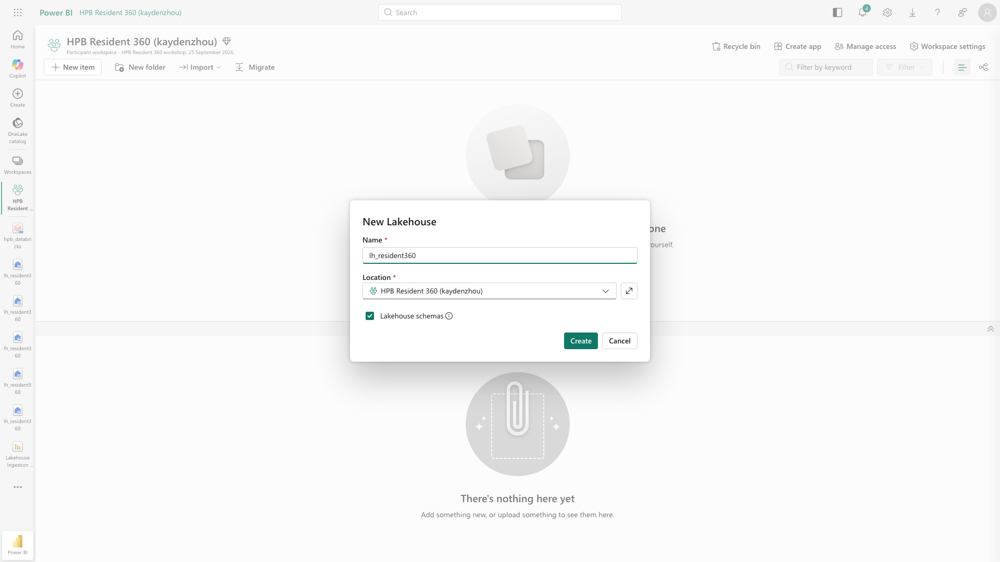

   The Lakehouse opens on its own explorer once created. **Tables** and **Files** are both empty — that is
   expected; you fill them in Task 2.

   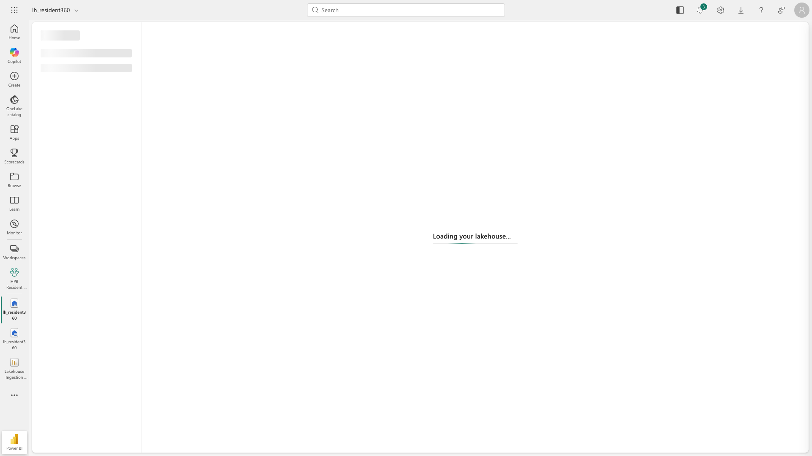

4. Back in the workspace, click **+ New item** again → search `Mirrored Azure Databricks` → click the
   **Mirrored Azure Databricks catalog** tile.

   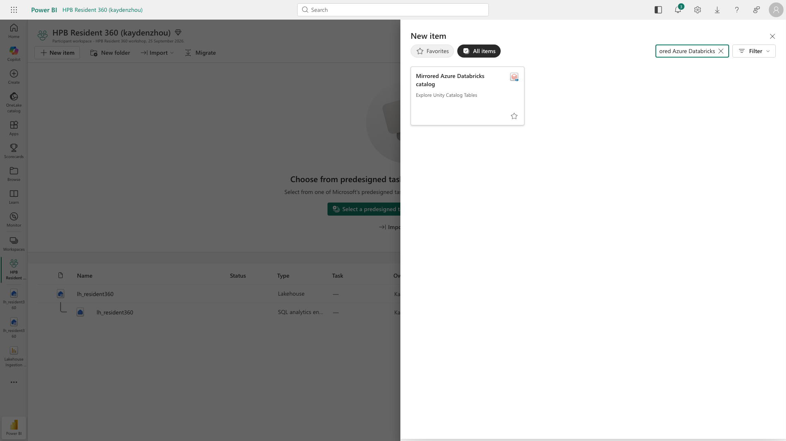

5. In the wizard, **Existing connection** is already selected and a **Connection name** dropdown reads
   *Select connection*. Choose **New connection**, then fill in **Connection settings**:

   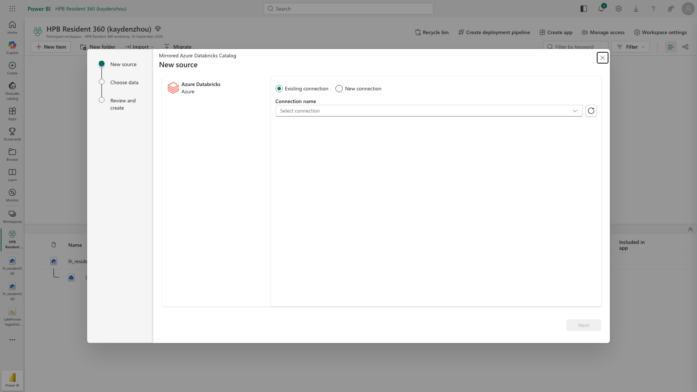

   - **URL** — the shared Databricks workspace URL your facilitator provides, e.g.
     `https://adb-....azuredatabricks.net`

   **As soon as you finish typing the URL, the panel changes** — but give it a moment. A spinner appears beside
   **Connection** while Fabric looks for a connection matching that URL. Until it settles the panel still reads
   *"You are not signed in. Please sign in."*, which is easy to mistake for the final state.

   Once it settles, Fabric has auto-selected the shared room connection and shows
   **Authentication kind: Service principal**. The sign-in prompt disappears and **Connect** turns green.

   That is the fast path. Click **Connect** — it validates the connection and then **relabels itself to Next**.
   The wizard does not move on by itself; click **Next** to reach **Choose data**.

   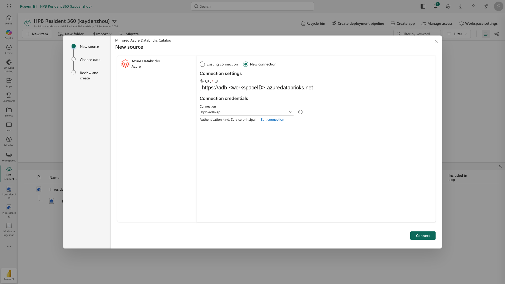

   > **Optional, and the more realistic one: connect as *yourself*.** The auto-selected connection runs under a
   > shared service identity, so Databricks audit logs show that identity rather than your name. In your own
   > tenant you would connect as yourself instead, and it is worth seeing once.
   >
   > To do that, after typing the URL open the **Connection** dropdown and pick **Create new connection**. The
   > **Authentication kind** returns as **Organizational account** — the OAuth 2.0 delegated sign-in — along with
   > a **Sign in** button. Do **not** pick Personal access token or Workspace identity; neither can read the
   > mirrored files.
   >
   > Clicking **Sign in** opens a separate **"Pick an account"** window. Choose your workshop account — you are
   > already signed in, so there is no password to type. The window closes by itself and **Connect** enables.

   > **Allow pop-ups for `app.fabric.microsoft.com`.** The sign-in opens in a new window; if your browser blocks
   > it, the wizard looks like it has hung. Use a normal desktop browser tab for this step — embedded or in-app
   > browser views often cannot complete the pop-up handshake.
   >
   > If sign-in ever says *"Sign in canceled,"* click **Sign in** again (1–3 tries). If it will not complete at
   > all, fall back to the auto-selected shared connection above; the mirror then works identically.

6. On **Choose data**, open **Catalog name** → **Select a catalog** and pick **`hpb_databricks`**. The table tree
   only appears once a catalog is chosen — before that the page reads *"No catalog selected"* and **Next** stays
   greyed out. Then check the **`gold`** schema → **Next**.

   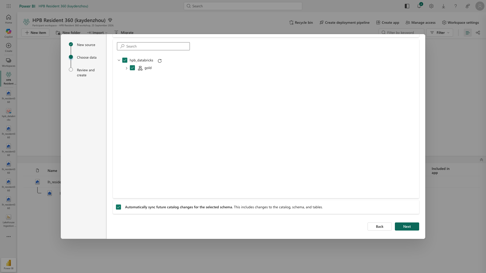

7. On **Review and create**, set the **Name** to **`hpb_databricks_mirror`** → **Create**.

   > ⚠️ **The Name box is pre-filled with `hpb_databricks`** — the catalog's own name. You must change it. Leaving
   > the default creates a mirror the notebooks cannot resolve, and the failure surfaces much later as
   > `TABLE_OR_VIEW_NOT_FOUND` in Task 2.

   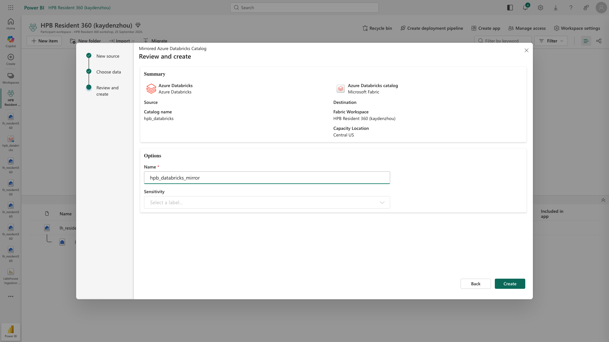

   > **Name check:** the notebooks expect **`hpb_databricks_mirror.gold`**. Use the mirror name above exactly;
   > otherwise the notebook table references will not resolve.
   >
   > **If you get the name wrong:** the item name *becomes* the Spark catalog name, so a mis-named mirror makes every
   > notebook cell fail with `TABLE_OR_VIEW_NOT_FOUND`. You can rename the item afterwards — but Spark caches the
   > catalog list **per session**, so you must then **stop and restart your notebook's Spark session** before the new
   > name resolves. Renaming alone is not enough.

8. The `gold` tables sync in 1–3 min. Open **`hpb_databricks_mirror`** — you should see the five `gold` tables
   listed, with **Mirrored / Success** status. Fabric is reading them in place; there is no copy.

   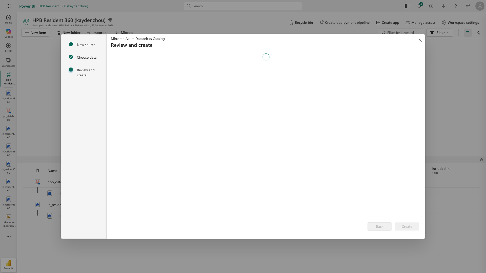

   **Verify (zero-copy):** switch to its **SQL analytics endpoint**. There are two ways to get there:
   - Inside the open mirror, click the **Databricks** dropdown (top-right) → **SQL analytics endpoint**, **or**
   - Click the green **View SQL endpoint** button in the centre of the mirror's page.

   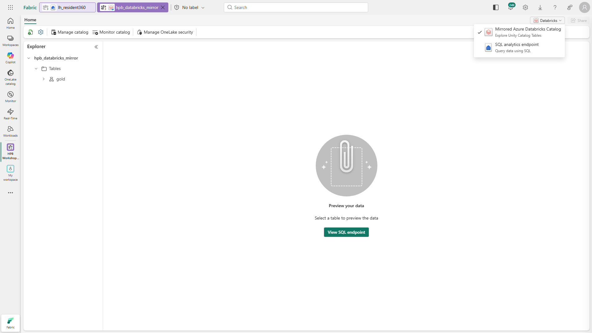

   Then **New SQL query** → run `SELECT COUNT(*) FROM hpb_databricks_mirror.gold.dim_resident;` → expect **1500**.

   > **If that errors with "invalid object name" — the data is fine, the *metadata* is stale.**
   > The SQL analytics endpoint caches its object list and can lag behind OneLake, sometimes by
   > hours. The mirror can show **Mirrored / Success** with all five tables listed and SQL still
   > not see `dim_resident`.
   >
   > Fix: on the mirror's SQL analytics endpoint, use **Refresh** (⟳ on the ribbon, or the
   > **Refresh metadata** option on the endpoint), wait a few seconds and re-run the query.
   > Tell your facilitator if it persists — this is a known condition they can clear.
   >
   > The same staleness can hide `gold.resident_360` from the **New semantic model** dialog in
   > Task 3. Same symptom, same fix.

   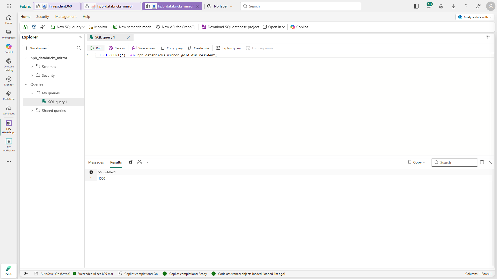

   > **Important:** the SQL analytics endpoint and Spark use separate permission paths. A green **1500** here does
   > **not** prove the notebook can read the mirror. The authoritative check is the **mirror smoke test at the top of
   > the notebook**, which runs `spark.table("hpb_databricks_mirror.gold.dim_resident").count()` and asserts **1500**.

   > 🚨 **Stop and call the facilitator if Spark cannot read the mirror.** In a reference run, the tenant-level
   > Unity Catalog setting **External Data Access** was disabled. The mirror still showed **Mirrored / Success** and
   > listed all tables, but every Spark read failed with:
   > - `PERMISSION_DENIED: External Data Access is disabled for metastore`
   > - `AccessDeniedException ... 403, HEAD ... _delta_log`
   >
   > This is a **tenant-level** setting, **not** a participant mistake, and **not** fixable by retrying or rebuilding.
   > Stop immediately and raise it with the facilitator.

> **Note:** don't shortcut the mirror into a `gold`/`silver`/`bronze` schema of `lh_resident360` — a read-only shortcut
> collides with the writable medallion you build next. The notebook reads the mirror directly instead.

---

### Task 2 — Upload the files & run the medallion notebook

This is the heart of the lab: land the seven raw files, then run **one notebook** that builds Bronze → Silver → Gold.
The notebook lands all seven files to Bronze; `residents_reference.csv` is retained as a reference table while the
Gold profile uses the mirrored Databricks `dim_resident` table.

> **Expected meal-log anomaly — do not fix:** `bronze.h365_meal_logs` holds **20,481** rows. The Silver transform
> drops one deliberately malformed `log_date` record to **20,480**, then a later Delta Lake time-travel demo appends
> one Apple snack row for `RESIDENT_00001` on 2026-06-30, so final `silver.fact_meal_log` is **20,481**. The matching
> Bronze/Silver counts are a coincidence, not a failed filter. Later, the data-quality gate reports `bad_dates: 1` out
> of `total: 20481` and **PASSES** — that is expected.

> **PSI is live:** `bronze.env_air_quality` is fetched from the public data.gov.sg API. Values can differ from
> screenshots and from your neighbour's — that's correct, not a bug. If the API is unreachable, the notebook silently
> falls back to illustrative values and continues; the lab still works. In a reference run the live PSI values were
> North-East **65**, Central **84**, North **73**, West **80**, East **70** — higher than the illustrative fallback
> figures. To see which path you got, read the PSI cell's printed output; it says whether it used the live API or the
> fallback.

#### 2a · Upload the seven app files to `Files/landing/`

1. Open **`lh_resident360`**. Hover the **Files** node → **⋯ (More options)** → **New subfolder** → name it **`landing`**.

   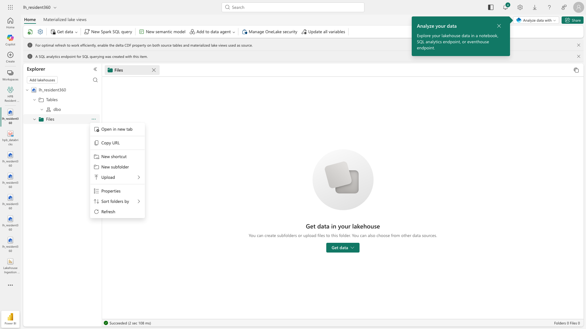

2. Hover **`landing`** → **⋯** → **Upload → Upload files** → select **all seven files** from the kit's `data/` folder.

   > ⚠️ **Check the destination before you upload.** The Upload pane shows the target path at the top, and it takes
   > that path from whichever node you opened the menu on. It must end in **`/lh_resident360/Files/landing/`**. If it
   > ends in `/Files/` you opened the menu on **Files** instead of **landing** — close the pane and start again from
   > the `landing` folder. Uploading one level too high succeeds silently, and the notebook then finds no files at
   > **Run all**, a long way from the cause.

   Then click **Upload** — selecting the files does not upload them, the pane stages them and waits for that button.
   Watch each file reach a green **Completed** check, then confirm the folder shows *"Files 7"*.

   

   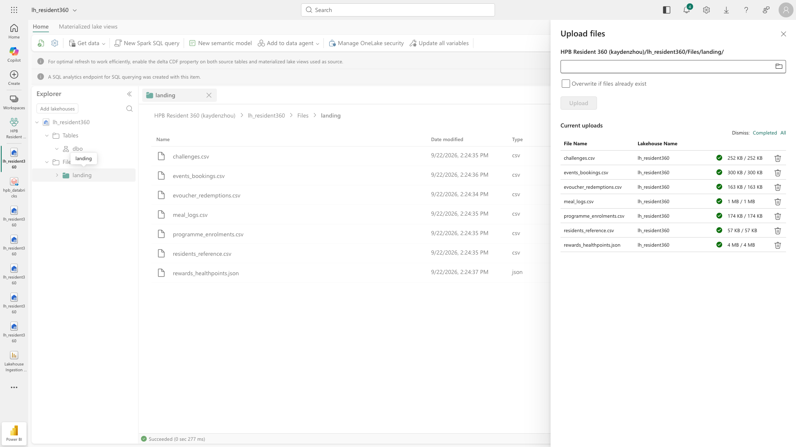

#### 2b · Import & attach the notebook

3. Workspace toolbar → **Import → Notebook → From this computer** → select
   **[`resident360_medallion.ipynb`](notebooks/resident360_medallion.ipynb)** from `resident-360-data-workshop/lab1-build-resident360/notebooks/` in the workshop kit you downloaded in Lab 0.

   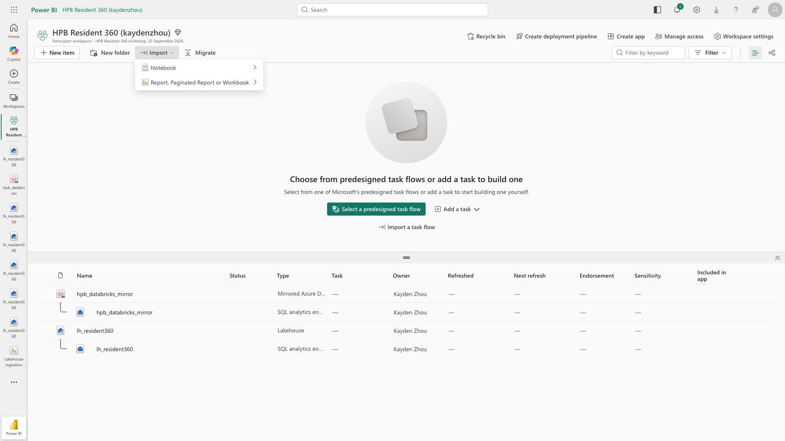

4. Open the notebook → Explorer **Add data items → From OneLake catalog** → check your **`lh_resident360`**
   **Lakehouse** → **Add**.

   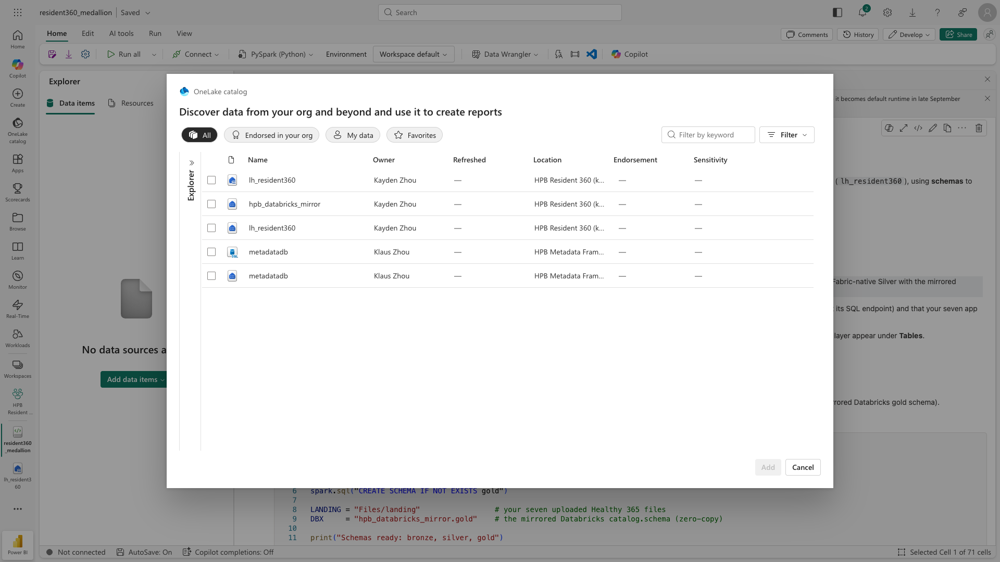

   > ⚠️ **The picker lists `lh_resident360` twice — tell them apart by the icon, not the text.**
   > Both rows show the same **Name**, the same **Owner** and the same **Location**, so there is nothing in the
   > words to choose between them. The **Lakehouse** icon is a house with a wave through it. The **SQL analytics
   > endpoint** icon is a rounded square with a grid of dots — the same icon you will see next to
   > `hpb_databricks_mirror` and `metadatadb`.
   >
   > Pick the **house-and-wave** one. It is the only one that can read `Files/landing/` and write tables; the SQL
   > endpoint cannot write, so **Run all** would fail partway with a permissions or write error.

   Once attached, the Explorer shows **`lh_resident360`** and the notebook is ready to **Run all**.

   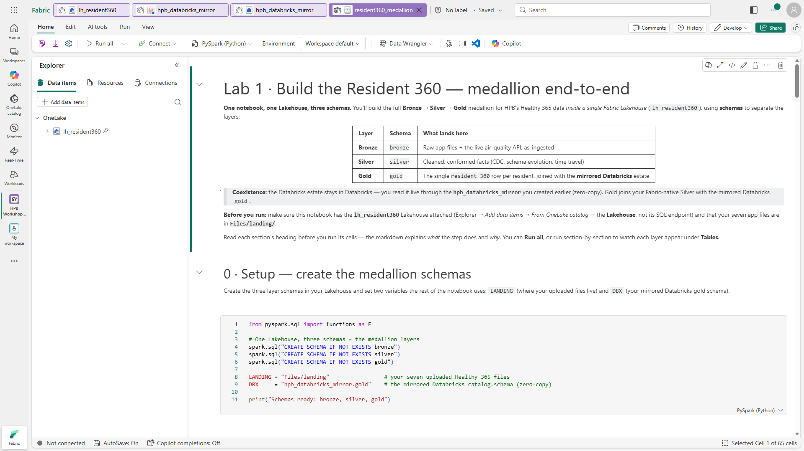

#### 2c · Run it — and try Data Wrangler, observability & Copilot

5. Read each section's markdown, then **Run all** (first run starts a Spark session, usually ~1–3 min in workshop
   dry runs). Watch the layers appear under **Tables**: `bronze.*` → `silver.fact_*` plus event helper tables →
   `gold.resident_360`. The full run was ~15–20 min in prior dry runs on a shared capacity; your duration depends on
   capacity load.

   > ⚠️ **Gold join check:** keep the gold joins outer-safe (`left` joins plus `coalesce` to **Not Screened**). The
   > verified `screening_risk` split includes **419 Not Screened** residents; an inner join silently loses them and
   > drops `gold.resident_360` below **1,500**. If Copilot suggests an inner join here, do not use it.

   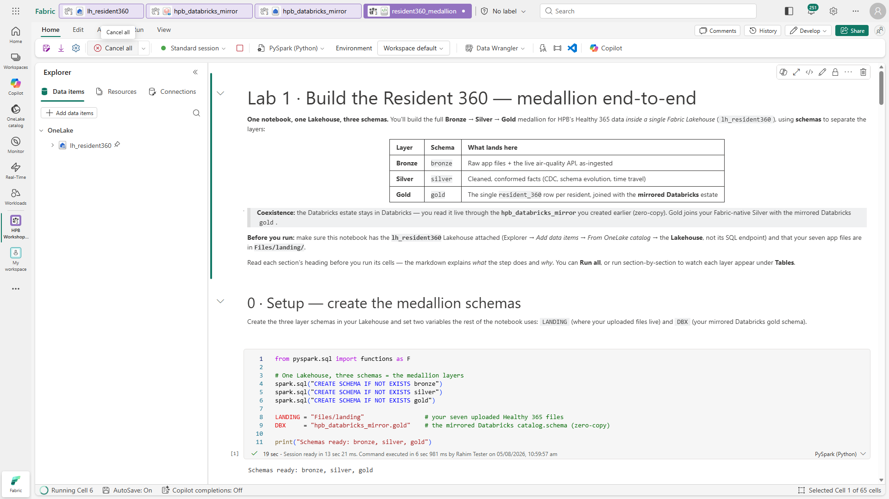

6. **Data Wrangler (Section 1).** After Bronze lands, explore Fabric's no-code data cleaning:
   1. On the ribbon choose **Home → Data Wrangler**. It lists the notebook's in-memory **DataFrames** by
      variable name — pick **`meals`**.

      > ⚠️ **Pick `meals`, with the "s". The list also contains `meal`, one letter apart, and it is a
      > completely different table.** `meals` is the raw Bronze read — **5,000 rows × 6 columns**
      > (`resident_id`, `log_date`, `meal_type`, `food_item`, **`calories`**, `healthier_choice_flag`).
      > `meal` is the per-resident aggregate built later in the notebook — 1,473 rows × 4 columns, whose
      > calorie column is **`avg_calories`**. If the header of the Data Wrangler page reads
      > **`Data Wrangler: meal`**, you have the wrong one: go back and pick `meals`.

      *(The Explorer route — expand **`lh_resident360` → Tables → `bronze`**, hover **`h365_meal_logs`** →
      **⋯** — also offers **Open in Data Wrangler** on some sessions, but the entry is not always present.
      The ribbon route above always works, so use it.)*
   2. In the left **Operations** panel, choose **Find and replace → Drop missing values**, select the **`calories`**
      column, and **Apply** — the row count drops from **5,000 to 4,998** (that column has exactly two missing
      values) and the change appears in the **Cleaning steps** list.
   3. Try a second operation: **Schema → Change column type**, target column `calories`, **New type →
      `float64`**.

      > **There is no "Decimal" in that list.** Data Wrangler converts your Spark DataFrame into a **pandas
      > sample** (the blue banner at the top says so), so the **New type** dropdown offers *pandas* dtypes —
      > `object`, `string`, `float16/32/64`, `int8/16/32/64`, `datetime64[ns]` and so on — not Spark or SQL
      > types. **`float64`** is the decimal one. The Bronze read has no schema inference, so `calories`
      > arrives as text; converting it to `float64` is a real change. Picking `object` leaves it as text and
      > the preview will tell you **"Data is unchanged"**.
   4. Click **Add code to notebook** (top right) — Data Wrangler adds the equivalent PySpark into a new cell so you
      can see how the selections became code. *(You don't need to run it — the notebook's Silver step performs the
      authoritative cleaning; this step is only to experience the tool.)*

   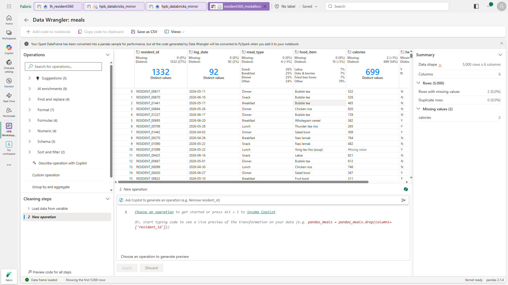

7. **Spark UI, monitoring & resource prioritisation (Section 6).** See *how* your jobs ran:
   1. Run the **skewed** cell, then the **tuned** cell in Section 6.
   2. Under a running/finished cell, click **… → View Spark job** (or the **Spark jobs** link) to open the **Spark UI**
      — compare the **skewed** job (one long-running task on a single partition) with the **tuned** job (many short,
      parallel tasks after Adaptive Query Execution).
   3. Left nav → **Monitor** → **Activities**. **You will not see "skewed" and "tuned" listed as two jobs** —
      Activities shows **one row per item run**, and both cells run inside the *same* notebook run. Look for the
      single row named **`resident360_medallion_<guid>`** and **click it** to open that run; the Spark detail
      for each cell is inside.

      > If that row says **In progress**, the notebook is still running and the per-cell detail will be
      > incomplete — wait for it to reach **Succeeded** before comparing. For comparing the two jobs against
      > each other, step 2's inline **Spark jobs** link under each cell is the faster route: it scopes
      > straight to that one cell's job.
   4. Read the **resource-prioritisation** note in the cell (custom pool / Autoscale Billing for Spark) — how a
      nightly ETL and ad-hoc queries share the capacity.

   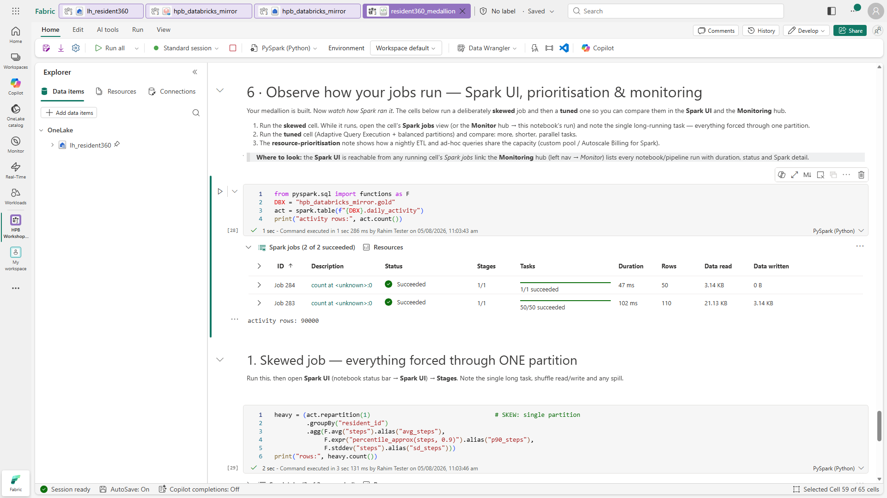

8. **Copilot in the notebook (Section 7).** Experience the AI assistant:
   1. Click **Copilot** on the notebook toolbar to open the chat panel.
   2. Ask it a concrete question about your data, for example:
      - *"Profile `gold.resident_360`: row count, % disengaged, and average steps by region. Add the result as a new cell."*
      - *"Chart average `avg_mvpa_min` by `age_band` from `gold.resident_360`."*
   3. Watch Copilot **plan → generate a cell → run it**, then review the cell it added.

   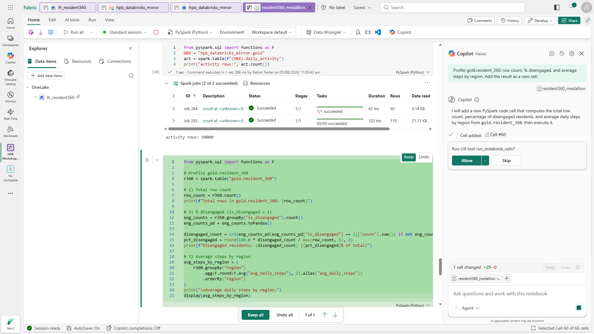

> **Done when you see:** `bronze.*` (8 tables, **64,578** rows total: 7 uploaded-file tables + `env_air_quality`),
> `silver.fact_*` (6) plus `silver.dim_event_occurrence` and `silver.map_resident_event_attendance` (8 tables,
> **68,302** rows total), and **`gold.resident_360`** (**1,500 rows x 31 columns**).
> Silver self-check: `dim_event_occurrence` **2,512**, `fact_challenge` **3,044**, `fact_event_attendance` **3,640**,
> `fact_evoucher_redemption` **2,566**, `fact_meal_log` **20,481**, `fact_programme_enrolment` **3,004**,
> `fact_rewards` **30,338**, `map_resident_event_attendance` **2,717**.
> The disengagement split is **182 disengaged / 1,318 engaged** — roughly 12% of 1,500. `screening_risk` is
> **High 301 · Low 246 · Moderate 534 · Not Screened 419**.

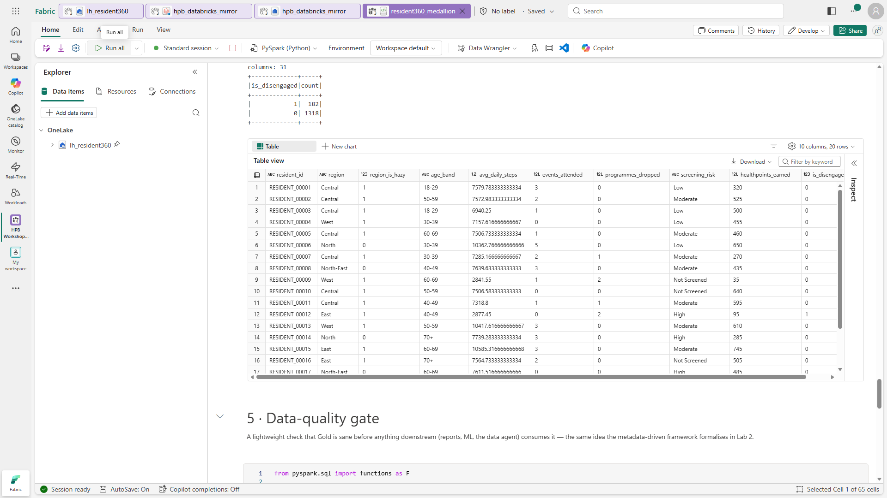

> **Recovery note:** if you fall behind, recover in phase order. Lab 2 and Lab 4 need the Silver tables (including
> event occurrence/attendance helpers), so do not rely on a Gold-only `resident_360_prebuilt` recovery until Silver
> has been created or restored.

---

### Task 3 — Semantic model

A **semantic model** is the layer reports and (later, in Lab 4) data agents read from. Build it on your **gold + selected silver**
tables so it and the Lab 4 ontology cover the **same governed medallion data** — that makes the Lab 4 comparison a fair one.

#### 3a · Create the model

1. Open **`lh_resident360`** → its **SQL analytics endpoint**. On the **Home** ribbon click **New semantic model**.

   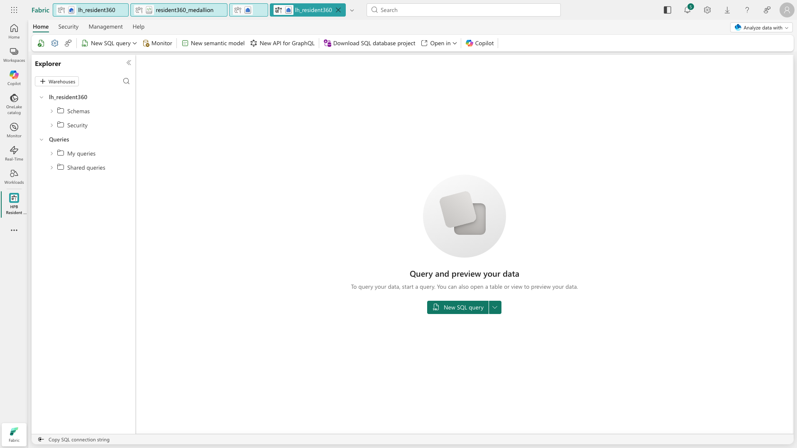

2. In the dialog:
   - **Name** the model **`sm_resident360`**.
   - Leave **Direct Lake on SQL** selected.
   - Select **`gold.resident_360`** and the five analytic silver facts — **`fact_event_attendance`**, **`fact_meal_log`**, **`fact_rewards`**, **`fact_programme_enrolment`**, **`fact_challenge`** (six tables in total). Do not select the Lab 4 helper tables `dim_event_occurrence` or `map_resident_event_attendance` for this semantic model.
   - Click **Confirm**.

   > ⚠️ Tick the **checkbox glyph** on each table row — clicking the row *name* only highlights it. Confirm all six are checked before **Confirm**.

   > ⚠️ **If a red "1 error occurred" banner appears after Confirm, do not click Confirm again.** Observed once
   > during dry runs: the banner appeared *and* `sm_resident360` was created correctly anyway. Check the workspace
   > list first — if the model is there, carry on to 3b. Clicking **Confirm** a second time creates a duplicate
   > model, and the rest of the lab then points at the wrong one.

   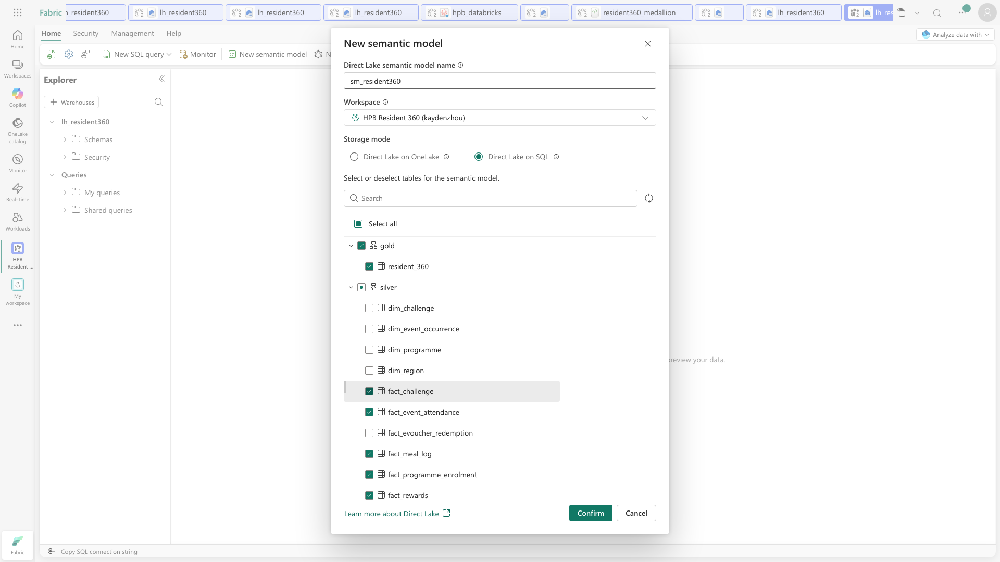

#### 3b · Add the star relationships

3. Open **`sm_resident360`** from the workspace list — it opens in **Model view**, starting in **Viewing** mode (read-only). Switch to **Editing**: click the **Viewing** button on the ribbon (top-left) → choose **Editing**.

   > **Note:** the model may **not** open automatically after **Confirm** — if it doesn't, open **`sm_resident360`** from the workspace list. The first switch to Editing shows a one-time *"Converting semantic model…"* message (~10 sec) — expected.

   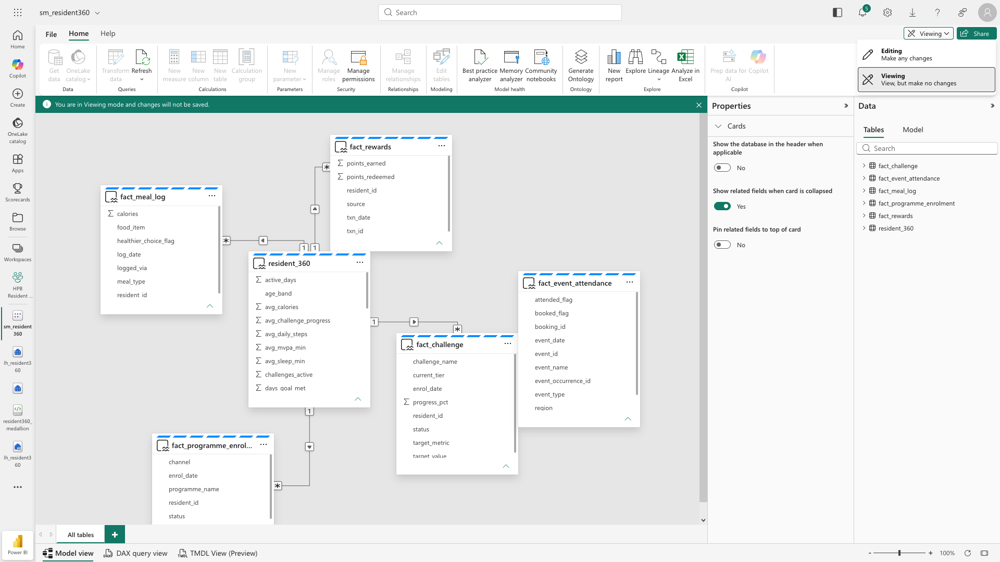

4. On the ribbon click **Manage relationships → + New relationship** and create **one relationship per fact**:
   - **From table:** the fact table, **column** `resident_id`
   - **To table:** `resident_360`, **column** `resident_id`
   - **Cardinality:** **Many to one (\*:1)** · **Cross-filter direction:** **Single** · **Make active:** on → **Save**.

   **Build the first one by hand** — `fact_event_attendance` — so you have seen the dialog and what each
   setting does. Then let **Copilot** do the remaining four.

   On the ribbon open **Copilot** and paste the prompt below. *(You must be in **Editing** mode — the
   whole ribbon, Copilot included, is greyed out in **Viewing** mode.)*

   ```text
   In this semantic model, create four relationships. Each one goes from the fact table's
   resident_id column to resident_360[resident_id], with cardinality many-to-one (*:1),
   cross-filter direction Single, and set to active:

   1. fact_meal_log[resident_id] -> resident_360[resident_id]
   2. fact_rewards[resident_id] -> resident_360[resident_id]
   3. fact_programme_enrolment[resident_id] -> resident_360[resident_id]
   4. fact_challenge[resident_id] -> resident_360[resident_id]

   Do not create any other relationships.
   ```

   > ⚠️ **Check Copilot's work — it is not deterministic.** When it finishes, open **Manage relationships**
   > and confirm there are **exactly five** rows, every one *:1, Single, Active, and joined on `resident_id`.
   > The most common miss is a relationship created in the wrong direction (1:* instead of *:1), which makes
   > the fact table filter `resident_360` rather than the other way round. The measure sanity check in 3c
   > catches it: `Meals Logged` returns blank if `fact_meal_log` is not traversing.

   > **Direct Lake note:** the editor always pre-fills *Many to one / Single* and can't preview data to validate — that's expected, and the defaults are correct here.

   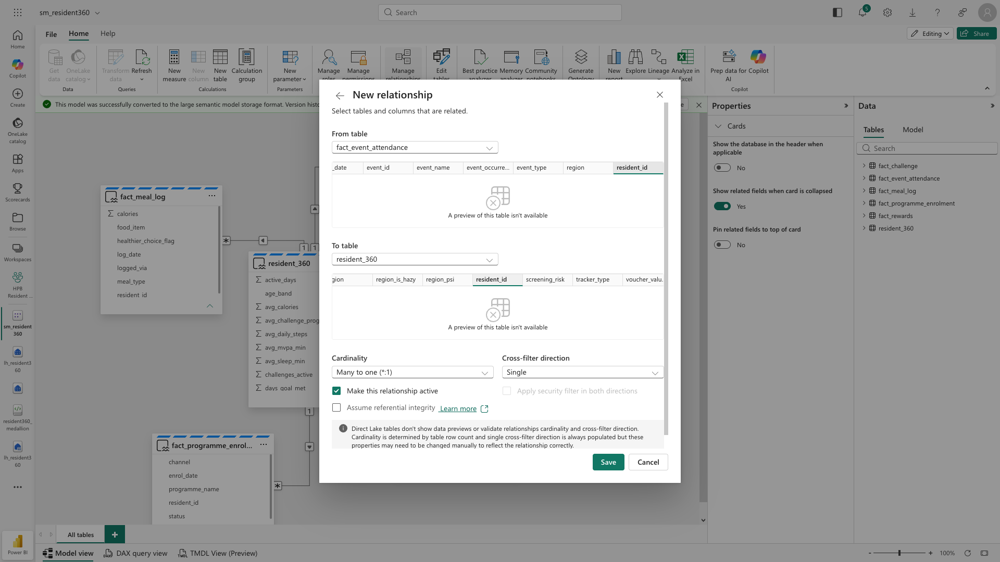

5. When done, **Manage relationships** lists all five (each fact → `resident_360`).

   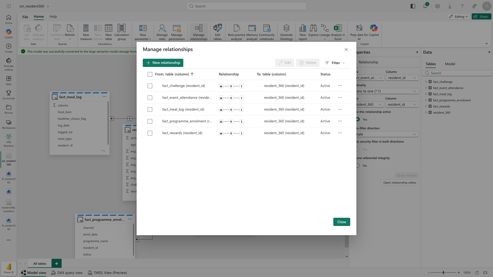

6. Close the dialog — `resident_360` sits at the centre with the five facts pointing to it (a star schema).

#### 3c · Add the core measures

A semantic model is **tables, relationships and measures**. Without measures, Copilot and
the Lab 4 data agents fall back to implicit column aggregation — they work, but they guess
at intent. Named measures make Task 4 and Lab 4 markedly better, and they take two minutes.

7. On the ribbon click **New measure**, paste the DAX, press the tick, then repeat. Put all
   of them on the **`resident_360`** table.

   | Measure | DAX | Format |
   |---|---|---|
   | `Residents` | `COUNTROWS('resident_360')` | `#,0` |
   | `Disengaged Residents` | `CALCULATE(COUNTROWS('resident_360'), 'resident_360'[is_disengaged] = 1)` | `#,0` |
   | `Disengagement Rate` | `DIVIDE([Disengaged Residents], [Residents])` | `0.0%` |
   | `Avg Daily Steps` | `AVERAGE('resident_360'[avg_daily_steps])` | `#,0` |
   | `Avg MVPA Minutes` | `AVERAGE('resident_360'[avg_mvpa_min])` | `#,0.0` |
   | `Events Attended` | `SUM('resident_360'[events_attended])` | `#,0` |
   | `Programmes Dropped` | `SUM('resident_360'[programmes_dropped])` | `#,0` |
   | `Healthpoints Earned` | `SUM('resident_360'[healthpoints_earned])` | `#,0` |
   | `Meals Logged` | `COUNTROWS('fact_meal_log')` | `#,0` |
   | `Avg Region PSI` | `AVERAGE('resident_360'[region_psi])` | `#,0` |
   | `Not Screened Residents` | `CALCULATE(COUNTROWS('resident_360'), 'resident_360'[screening_risk] = "Not Screened")` | `#,0` |

   > **Sanity check.** `Residents` should be **1,500**, `Disengaged Residents` about **182**,
   > `Disengagement Rate` about **12.1%**, and `Not Screened Residents` **419**. `Meals Logged`
   > reaching **20,481** proves your relationship to `fact_meal_log` is actually traversing —
   > if it returns blank, the relationship in 3b did not save.

   **Add the first three by hand** — `Residents`, `Disengaged Residents`, `Disengagement Rate` — so you
   have used the formula bar and the format box. Then let **Copilot** add the other eight.

   On the ribbon open **Copilot** and paste the prompt below. *(You must be in **Editing** mode — the
   whole ribbon, Copilot included, is greyed out in **Viewing** mode.)*

   ```text
   In this semantic model, add these eight measures to the resident_360 table, using exactly
   the DAX and format string given. Do not change the names, the DAX, or the formats.

   Avg Daily Steps          = AVERAGE('resident_360'[avg_daily_steps])                                        format #,0
   Avg MVPA Minutes         = AVERAGE('resident_360'[avg_mvpa_min])                                           format #,0.0
   Events Attended          = SUM('resident_360'[events_attended])                                            format #,0
   Programmes Dropped       = SUM('resident_360'[programmes_dropped])                                         format #,0
   Healthpoints Earned      = SUM('resident_360'[healthpoints_earned])                                        format #,0
   Meals Logged             = COUNTROWS('fact_meal_log')                                                      format #,0
   Avg Region PSI           = AVERAGE('resident_360'[region_psi])                                             format #,0
   Not Screened Residents   = CALCULATE(COUNTROWS('resident_360'), 'resident_360'[screening_risk] = "Not Screened")   format #,0
   ```

   > ⚠️ **Check Copilot's work — it is not deterministic.** It may rename a measure, rewrite the DAX into
   > something equivalent-looking, or put a measure on the wrong table. Use the sanity check above: if
   > `Residents` is not **1,500**, `Not Screened Residents` not **419**, or `Meals Logged` not **20,481**,
   > open the measure and compare it against the table. `Meals Logged` is the one that depends on 3b's
   > relationships, so a blank there points back to a relationship, not to the measure.

   > **Short on time?** The first three are enough to carry on. `Disengagement Rate` is the one the report
   > and both Lab 4 agents lean on hardest.

   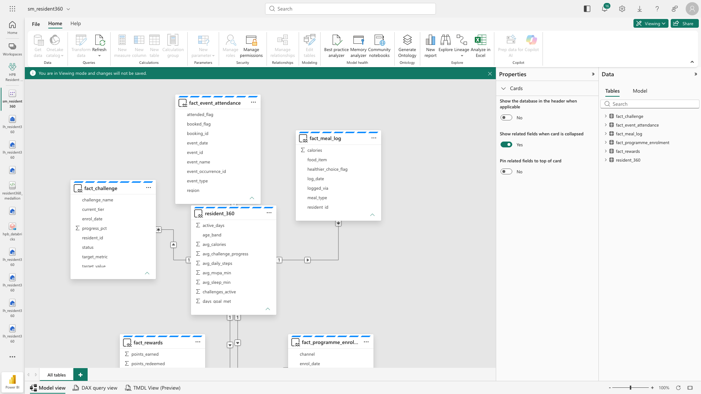

---

### Task 4 — Let Copilot build the report

Instead of hand-placing visuals, let **Copilot** suggest and build the report pages for you.

1. In the workspace list, hover the **`sm_resident360`** row → **⋯ (More options)** → **Create report**. This opens the
   report editor bound to `sm_resident360` (its tables appear in the **Data** pane).
   > *Tip:* the model view also has a **New report** button, but the **⋯ → Create report** path from the list is the
   > most reliable.

   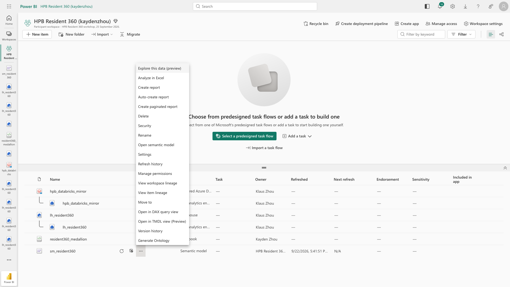

2. In the report editor, click **Copilot** on the toolbar to open the panel, then choose
   **Suggest content for a new report page**. Copilot proposes an outline of pages built from the model's tables
   (e.g. activity, events, programmes, rewards by region or demographic).

   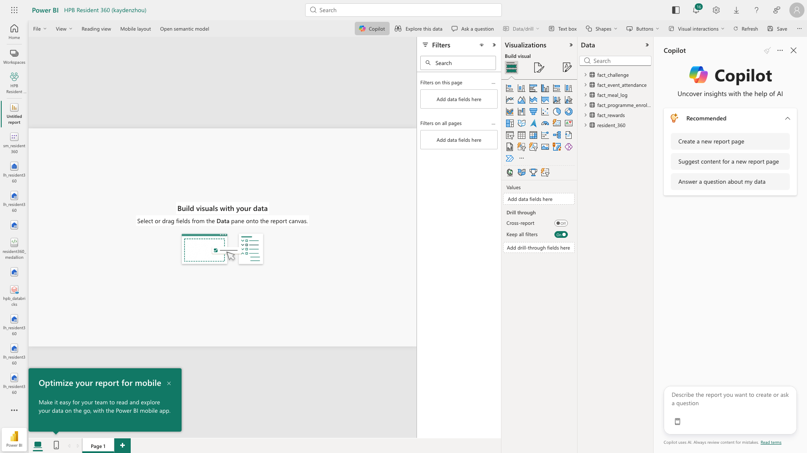

   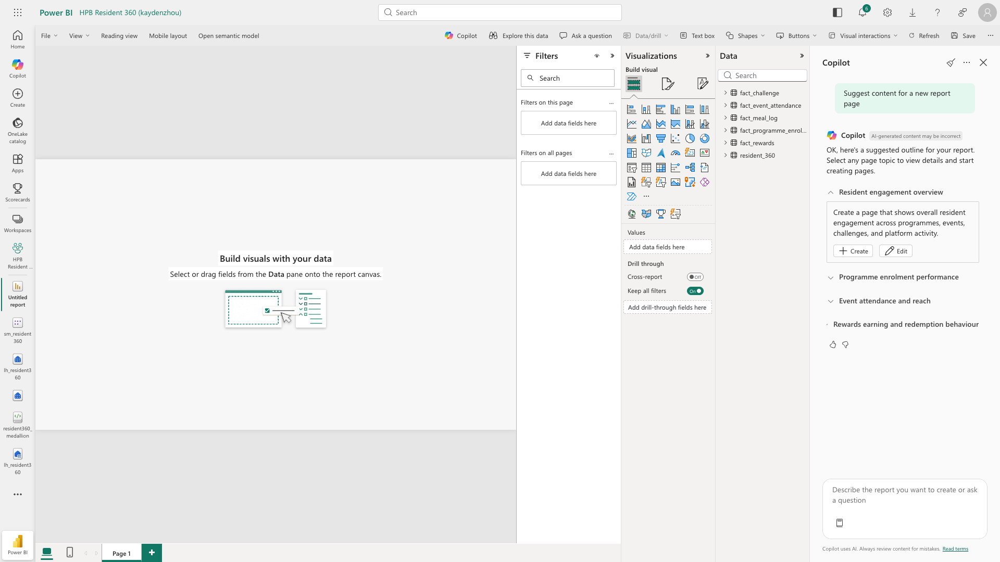

3. Click **Create** under a page you like — Copilot builds the page and lays out the visuals for you. Repeat for any
   other pages, then press **Ctrl+S** and **Save** the report as **`rpt_resident360`**.

   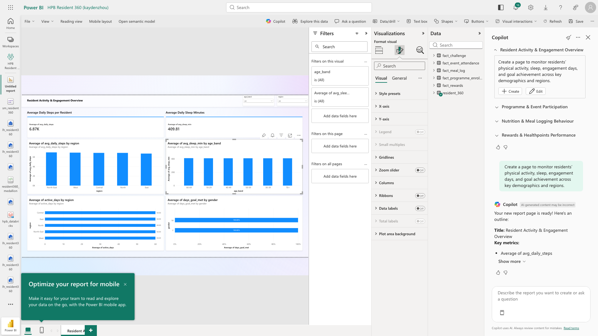

> **Done when you see:** a report Copilot built from your semantic model — no manual visual placement. *(Copilot drafts
> may briefly show an axis warning on a visual until the fields settle — that's normal.)*

---

### ✅ Checkpoint
- [ ] **Task 1** — `lh_resident360` Lakehouse + `hpb_databricks_mirror` created; zero-copy count on the mirror's SQL analytics endpoint = **1500**
- [ ] **Task 2** — one notebook built `bronze.*`, `silver.fact_*`, the event occurrence/attendance helpers, and `gold.resident_360` (1,500 rows; disengagement split printed by your run); tried **Data Wrangler**, the **Spark UI / Monitor**, and **Copilot in the notebook**
- [ ] **Task 3** — `sm_resident360` semantic model (Direct Lake) with **five Many-to-one** relationships (each selected silver fact → `gold.resident_360`) and the **core measures** added (`Residents` = 1,500, `Disengagement Rate` ~ 12.1%, `Meals Logged` = 20,481)
- [ ] **Task 4** — a **Copilot-built** report saved as **`rpt_resident360`**

---

### Next up
**[Lab 2 · Govern & Trace](../lab2-metadata-lakehouse/README.md)**
