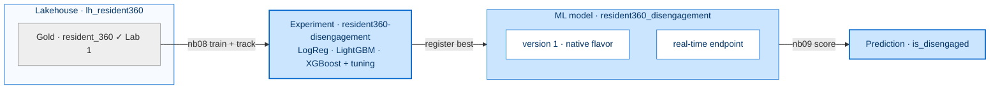
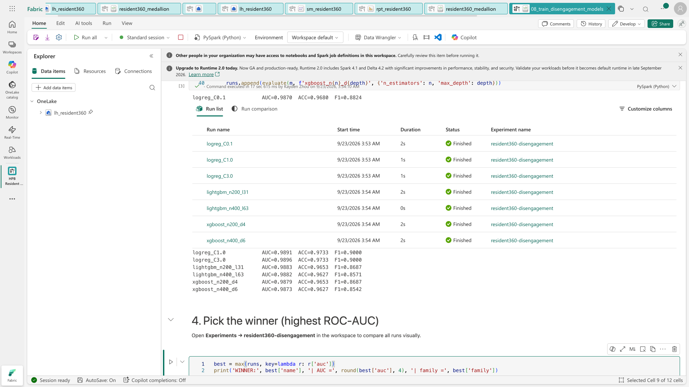
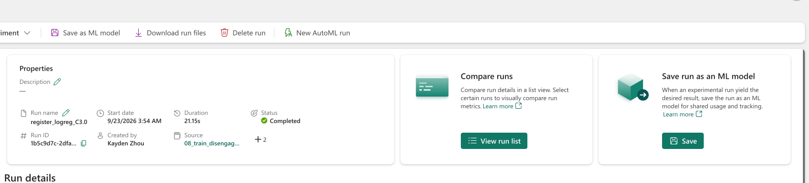
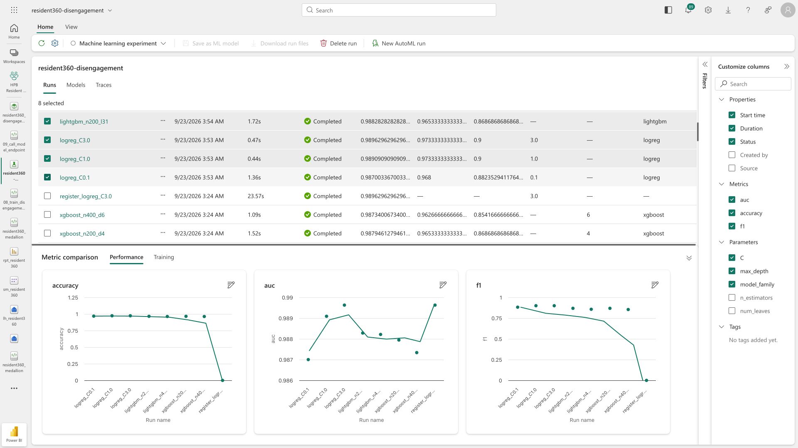
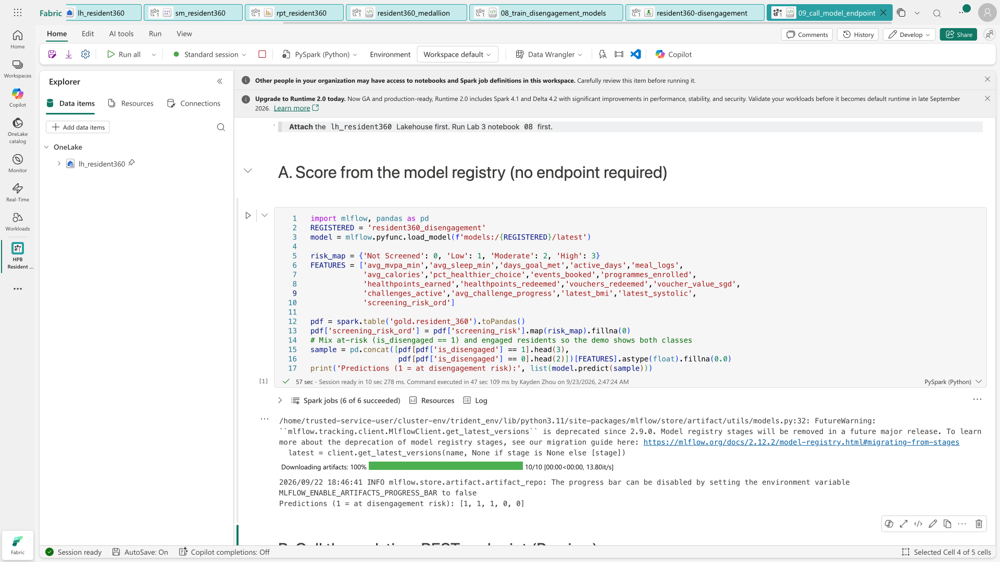
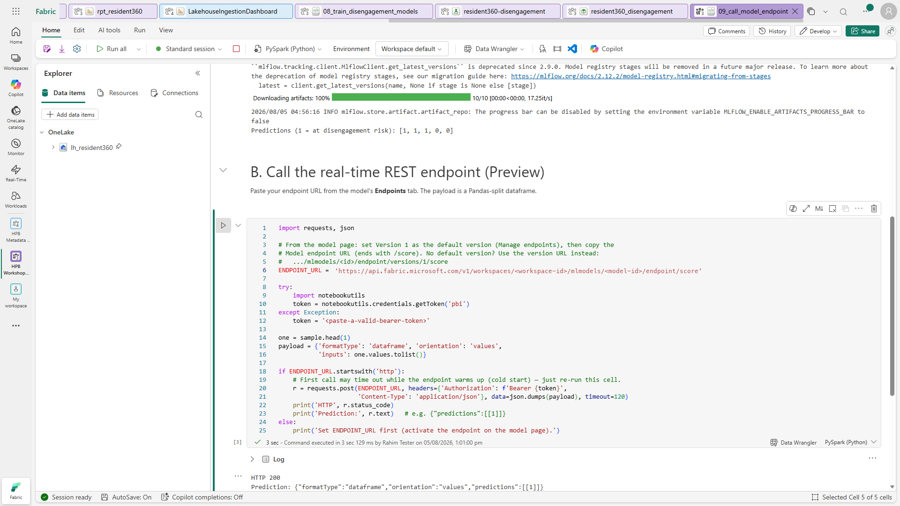

[← Workshop home](../README.md)

# Lab 3 · Nudges That Land
## Train, compare & serve a model in real time

**⏱ 45 min**  ·  **🎯 Focus:** ML pipeline · experiments · real-time endpoint

### The story
To nudge Rahim *before* he disengages, HPB needs a model that spots early warning signs. We train three model
families, tune them, track every run, then serve the best one on a **real-time endpoint** so the app can score a
resident live.

### You'll build
- An **ML pipeline** training **Logistic Regression, LightGBM, XGBoost** with **hyperparameter tuning**.
- An **MLflow experiment** comparing every run's ROC-AUC / accuracy / F1.
- The winning model **registered** as a native flavor and served on a **real-time REST endpoint**.

### Where this fits

**Builds on:** Lab 1's Gold (label `is_disengaged`). Turns the data into a live prediction service.

### Files
- [`notebooks/08_train_disengagement_models.ipynb`](notebooks/08_train_disengagement_models.ipynb) — train + tune + track + register
- [`notebooks/09_call_model_endpoint.ipynb`](notebooks/09_call_model_endpoint.ipynb) — score from the registry and via the live endpoint

> Import both notebooks — they are in `resident-360-data-workshop/lab3-datascience-ml/notebooks/` in the workshop kit you downloaded in Lab 0 — and attach **`lh_resident360`**. Target = `is_disengaged` from `gold.resident_360`.
> The three columns that *define* the label are excluded from the features, so the models learn genuine risk
> signals (MVPA, sleep, diet, healthpoints, challenges, screening) rather than memorising the rule.

---

### Task 1 — Train & compare models
1. Open **`08_train_disengagement_models`**, attach the Lakehouse, **Run all**.
2. It trains and tunes three families, logging **one MLflow run per configuration** with params + metrics.
3. Read the printed leaderboard — each run shows AUC / accuracy / F1, and the **winner** (highest AUC) is chosen.

> **What to expect:** In a reference run the notebook trained **7 model runs** and selected **`logreg_C3.0`**
> with ROC-AUC **0.9896**. Logistic regression typically wins here, ahead of LightGBM and XGBoost. An
> AUC around **0.99 is expected on this dataset** and is not a sign that you have done something wrong —
> the data is synthetic, so the remaining features still track disengagement closely even though the three
> label-defining columns are excluded. The registered model is **`resident360_disengagement`**.

> **Done when you see:** a printed leaderboard with the winner and AUC / accuracy / F1 values produced by **your**
> run, plus the model **`resident360_disengagement`** registered in the workspace. The screenshot is illustrative;
> exact winner and metrics can vary.

> ⚠️ **On a cold session, `Run all` stops after the first cell — click `Run all` again.**
> The dependency cell installs LightGBM/XGBoost when the session lacks them (~1 min) and then **restarts the
> kernel**. That restart **aborts the rest of the `Run all`**: the status bar drops to **Not connected**, cells
> 2 onwards never execute, and *nothing tells you*. Cell 1 shows
> `Warning: PySpark kernel has been restarted to use updated packages.` — when you see that, simply click
> **Run all** a second time. The packages are installed by then, so the second pass runs straight through
> (about 2 minutes) and no further restart happens.
>
> On a warm session the imports succeed, no install or restart occurs, and the first `Run all` completes
> normally. Either way you do not need to add a `pip install` of your own. Observed versions:
> **LightGBM 4.3.0**, **XGBoost 2.0.3**.

### Task 2 — Start the endpoint activation (then leave it running)

**Do this before Task 3.** Activation provisions a real serving endpoint and takes **several minutes**.
Kick it off now and compare your runs while it works — by the time you come back it should be **Active**.

1. Notebook `08` already **registered the winner** as `resident360_disengagement` with a scalar signature
   (native flavor = servable), so there is nothing to register by hand.
2. In the workspace list click **`resident360_disengagement`** (item type **ML model**).
3. In the version list on the left, click **Version 1**. The **Version details** page opens.
4. On the **Home** ribbon, at the right-hand end, click **Activate version endpoint** — then **choose
   *Activate version endpoint* from the menu that drops down**.

   > ⚠️ **It is a menu button, not a plain button.** Note the small chevron. Clicking the button only
   > opens a menu containing *Activate version endpoint* and *Deactivate version endpoint*; if you click
   > the button and walk away, **nothing happens and nothing tells you** — the endpoint stays `Inactive`.
   > You must pick the item.

   > **This must happen before you can set a default version.** The Manage endpoints pane will not accept a
   > default until that version has an *active* endpoint — it warns *"Select a version with an active
   > endpoint, or activate the endpoint for this default version."* Activate first, set the default after.

   > **Can't see it?** It is on the **Home** ribbon of the *version details* page — not the model page —
   > to the right of **Compare endpoint metrics**. The ribbon collapses it on a narrow window; maximise
   > or zoom out.

5. **Status** under *Endpoint details* moves `Inactive → Activating → Active`. It lags — use **Refresh**.

   > **The quickest check is the ribbon itself:** once the endpoint is live, that button's label flips to
   > **Deactivate version endpoint**. If it still reads *Activate*, it has not started.

   **Do not wait here.** Go to Task 3 and come back in Task 4.

---

### Task 3 — Compare runs in the experiment

*(Your endpoint is provisioning in the background while you do this.)*

1. In your workspace list, click **`resident360-disengagement`** (item type **Experiment**).

   It opens in **Details** view, showing one run at a time. **There is no "Compare" button** — the
   comparison lives in the *list* view.

   

2. Switch to the list: click **View run list** on the **Compare runs** card (above), or use the ribbon
   **View → List**.

   You now get one row per run, with **auc**, **accuracy** and **f1** as sortable columns. Click the
   **auc** column header to rank them.

3. **Tick the checkbox on two or more runs.** The **Metric comparison** panel along the bottom fills in
   as soon as the second one is selected — it has **Performance** and **Training** tabs. Until then it
   just says *"Select runs to compare their metrics"*. Ticking all of them is the interesting view: the
   three model families side by side.

   *(The **Customize columns** pane on the right toggles which metrics and parameters are shown —
   `C`, `max_depth`, `n_estimators`, `num_leaves` and so on, so you can see which hyperparameter moved
   which metric.)*

> **Why does `register_logreg_C3.0` have an `auc` but no `accuracy` or `f1`?** That run is the
> *registration* step from Section 5 of the notebook, not a training run — it logs the winning model,
> not a fresh evaluation. The seven runs below it are the trained ones.

> **Fun fact:** MLflow is the same open-source tracking you may use in Databricks — it works natively in Fabric,
> no setup required.

### Task 4 — Finish the endpoint, then score sample residents

**First, finish what Task 2 started.**

1. Go back to **`resident360_disengagement` → Version 1** and confirm **Status = Active** (click **Refresh**
   if it still says *Activating*). Registry scoring in step 4 below works either way, but the live endpoint
   call in step 5 does not.
2. Ribbon → **Manage endpoints**. Set **Default version → Version 1**. It applies immediately — there is no
   Save button. Without this the friendly URL returns **HTTP 404** (`EndpointOrResourceNotFound`).
3. Still in **Manage endpoints**, copy the **Model endpoint URL** (it ends with `/score`) for step 5.

**Now score.**

4. Open **`09_call_model_endpoint`**, attach the Lakehouse.
5. **Option A — registry:** run the first cell to load the model and score five residents in-notebook. This
   needs no endpoint at all.
6. **Option B — endpoint:** paste the `/score` URL from step 3 into `ENDPOINT_URL`, run the cell, and read the
   HTTP status plus prediction JSON printed by your run. The predicted class depends on the sampled resident.

   > **Two URL forms, both valid once Version 1 is active and set as default:**
   >
   > | URL | Needs a default version? |
   > |---|---|
   > | `…/mlmodels/<id>/endpoint/score` (friendly) | **Yes** — 404s without it |
   > | `…/mlmodels/<id>/endpoint/versions/1/score` | No — targets the version directly |
   >
   > On a reference run both returned `HTTP 200` with `{"predictions":[[1],[1]]}`, and both residents
   > scored were genuinely `is_disengaged = 1`.

> **No-code alternative:** on the model's version page, ribbon **Preview predictions** → **Autofill** (or
> enter feature values) → **Get predictions** calls the live endpoint and shows the result right in the UI —
> a convenient way to confirm the endpoint works without touching the notebook.

> **Note:** The first endpoint call may fail with a `ReadTimeout` while the endpoint warms up (cold start).
> Simply run the cell again — the warmed endpoint responds in a few seconds.
>
> **Alternative:** If you skip setting a default version (Task 4 step 2), call a specific version instead by
> using the version scoring URL: `…/mlmodels/<id>/endpoint/versions/1/score`.

---

### ✅ Checkpoint
- [ ] Three model families trained + tuned; runs visible in the experiment
- [ ] Winner registered as a native flavor
- [ ] Version 1's endpoint reached **Active**, and is set as the **default version**
- [ ] Registry scoring returned a prediction list (Option A)
- [ ] Real-time endpoint returned a live prediction (Option B)

---

### Next up
**[Lab 4 · Just Ask](../lab4-ontology-dataagent/README.md)**

