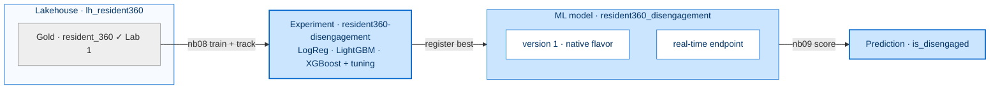
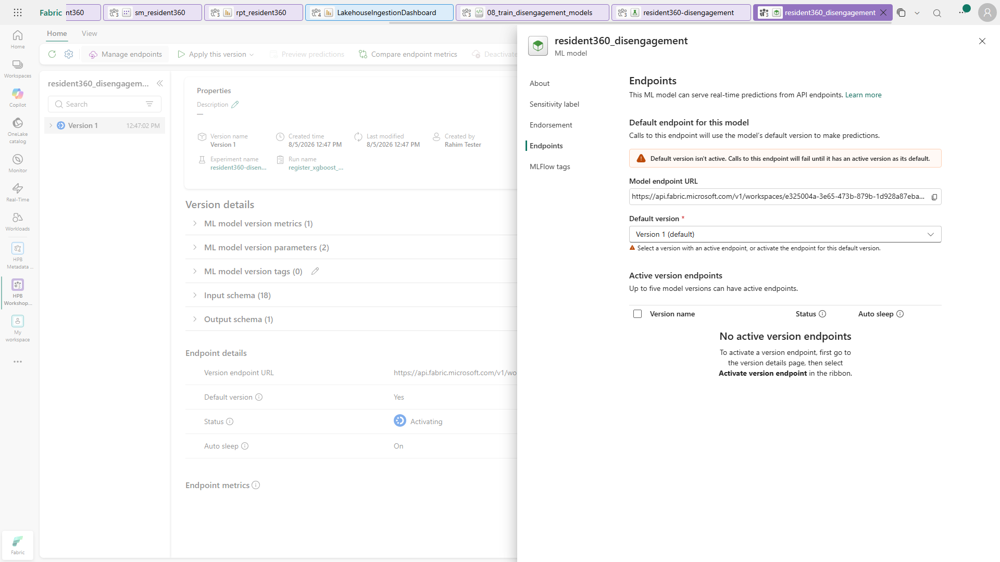

[← Workshop home](../README.md)

# Lab 3 · Nudges That Land
## Train, compare & serve a model in real time

**⏱ 45 min**  ·  **🎯 Focus:** ML pipeline · experiments · real-time endpoint

### The story
To nudge Rahim *before* he disengages, HPB needs a model that spots early warning signs. We train three model
families, tune them, track every run, then serve the best one on a **real-time endpoint** so the app can score a
resident live.

### You'll build
- An **ML pipeline** training **Logistic Regression, LightGBM, XGBoost** with **hyperparameter tuning**.
- An **MLflow experiment** comparing every run's ROC-AUC / accuracy / F1.
- The winning model **registered** as a native flavor and served on a **real-time REST endpoint**.

### Where this fits

**Builds on:** Lab 1's Gold (label `is_disengaged`). Turns the data into a live prediction service.

### Files
- `notebooks/08_train_disengagement_models.ipynb` — train + tune + track + register
- `notebooks/09_call_model_endpoint.ipynb` — score from the registry and via the live endpoint

> Import both notebooks and attach **`lh_resident360`**. Target = `is_disengaged` from `gold.resident_360`.
> The three columns that *define* the label are excluded from the features, so the models learn genuine risk
> signals (MVPA, sleep, diet, healthpoints, challenges, screening) rather than memorising the rule.

---

### Task 1 — Train & compare models
1. Open **`08_train_disengagement_models`**, attach the Lakehouse, **Run all**.
2. It trains and tunes three families, logging **one MLflow run per configuration** with params + metrics.
3. Read the printed leaderboard — each run shows AUC / accuracy / F1, and the **winner** (highest AUC) is chosen.

> **What to expect:** In a reference run the notebook trained **7 model runs** and selected **`logreg_C3.0`**
> with ROC-AUC **0.9896**. Logistic regression typically wins here, ahead of LightGBM and XGBoost. An
> AUC around **0.99 is expected on this dataset** and is not a sign that you have done something wrong —
> the data is synthetic, so the remaining features still track disengagement closely even though the three
> label-defining columns are excluded. The registered model is **`resident360_disengagement`**.

> **Done when you see:** a printed leaderboard with the winner and AUC / accuracy / F1 values produced by **your**
> run, plus the model **`resident360_disengagement`** registered in the workspace. The screenshot is illustrative;
> exact winner and metrics can vary.

> **Note:** The dependency cell installs LightGBM/XGBoost only **if the session lacks them** (~1 min, with one
> kernel restart) — that's expected and the run continues automatically. In practice the Fabric ML runtime
> already ships them (observed: **LightGBM 4.3.0**, **XGBoost 2.0.3**), so the install is normally skipped and
> the cell just prints the versions. You do not need to add a `pip install` of your own.

### Task 2 — Compare runs in the experiment
1. Workspace → open **Experiments → `resident360-disengagement`**.
2. Select the runs → **Compare** → sort by **auc**. See how the model families and hyperparameters stack up.

> **Fun fact:** MLflow is the same open-source tracking you may use in Databricks — it works natively in Fabric,
> no setup required.

### Task 3 — Register & activate the endpoint

> **Verified on a reference run.** The endpoint moved
> `Inactive → Activating → Active` in about four minutes, and with **Default version = Version 1**
> set, *both* URLs scored successfully:
>
> | URL | Result |
> |---|---|
> | `…/mlmodels/<id>/endpoint/score` (friendly) | `HTTP 200` · `{"predictions":[[1],[1]]}` |
> | `…/mlmodels/<id>/endpoint/versions/1/score` | `HTTP 200` · `{"predictions":[[1],[1]]}` |
>
> Both residents scored were genuinely `is_disengaged = 1`, so `1` is the correct prediction.
> The friendly URL only resolves **after** the default version is set — that step is not optional.

1. Notebook `08` already **registers the winner** as `resident360_disengagement` with a scalar signature (native
   flavor = servable).
2. Open the model **`resident360_disengagement`** (from the workspace list) → select **Version 1** → in the ribbon
   select **Activate version endpoint**. Wait for **Status = Active** (endpoint provisioning takes several
   minutes on first activation — use **Refresh** to check).
3. **Set the default version** so the friendly scoring URL resolves: **Manage endpoints → Default version →
   Version 1**. The selection applies immediately (no Save button). Without this, the default endpoint URL
   returns HTTP 404 (`EndpointOrResourceNotFound`).
4. Open **Manage endpoints** → copy the **Model endpoint URL** (ends with `/score`) for Task 4B.

> **Note:** Registry scoring (Task 4A) works even before the endpoint is activated.
>
> **Can't see the `Activate version endpoint` button?** It lives in the **Home** ribbon of the version
> details page, but the ribbon **collapses it when the browser window is narrow** — maximise the window
> (or zoom out) and it reappears as a split button. Select it → **Activate version endpoint**. The
> **Status** field can lag; click **Refresh** to see it move `Deactivated → Activating → Active`.

### Task 4 — Score sample residents
1. Open **`09_call_model_endpoint`**, attach the Lakehouse.
2. **Option A — registry:** run the first cell to load the model and score five residents in-notebook.
3. **Option B — endpoint:** paste the `/score` URL from Task 3 into `ENDPOINT_URL`, run the cell, and read the
   HTTP status plus prediction JSON printed by your run. The predicted class depends on the sampled resident.

> **No-code alternative:** on the model's version page, ribbon **Preview predictions** → **Autofill** (or
> enter feature values) → **Get predictions** calls the live endpoint and shows the result right in the UI —
> a convenient way to confirm the endpoint works without touching the notebook.

> **Note:** The first endpoint call may fail with a `ReadTimeout` while the endpoint warms up (cold start).
> Simply run the cell again — the warmed endpoint responds in a few seconds.
>
> **Alternative:** If you skip setting a default version (Task 3 step 3), call a specific version instead by
> using the version scoring URL: `…/mlmodels/<id>/endpoint/versions/1/score`.

---

### ✅ Checkpoint
- [ ] Three model families trained + tuned; runs visible in the experiment
- [ ] Winner registered as a native flavor
- [ ] Real-time endpoint returns a live prediction

---

### Next up
**[Lab 4 · Just Ask](../lab4-ontology-dataagent/README.md)**

