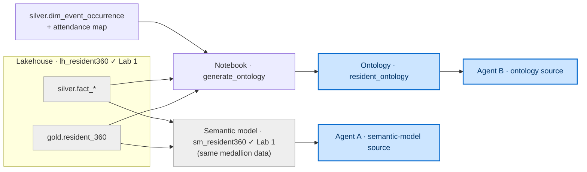
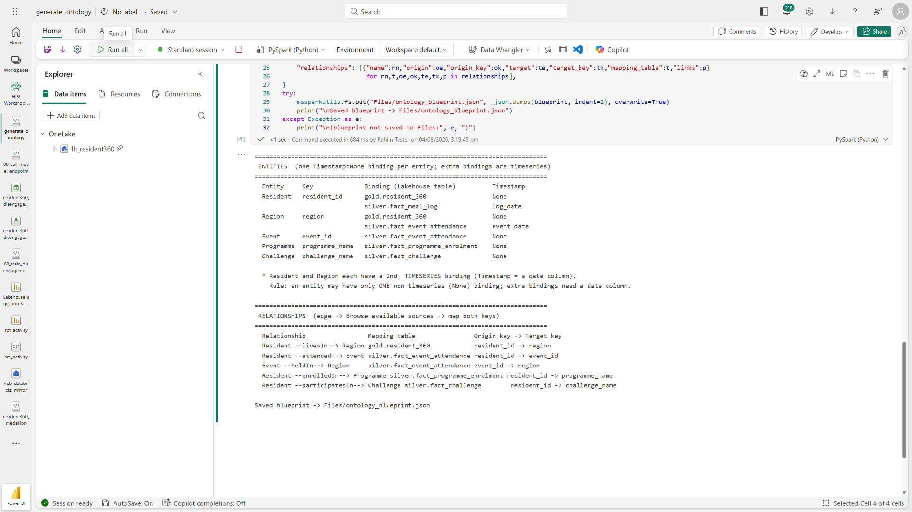
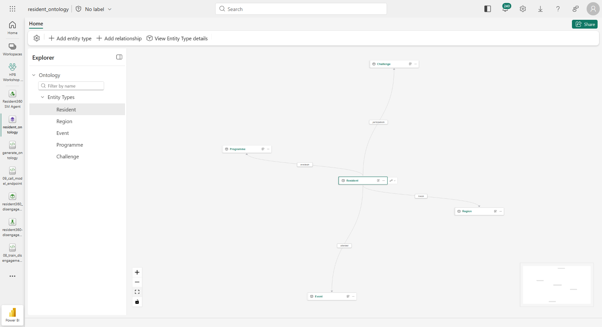
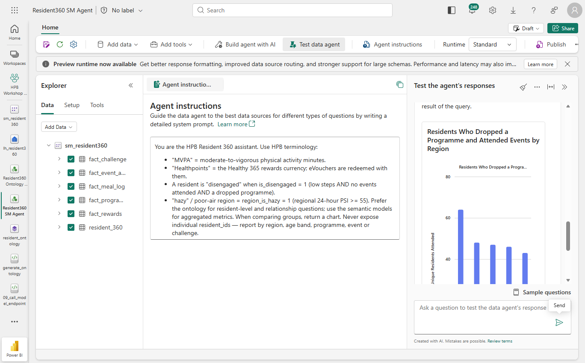
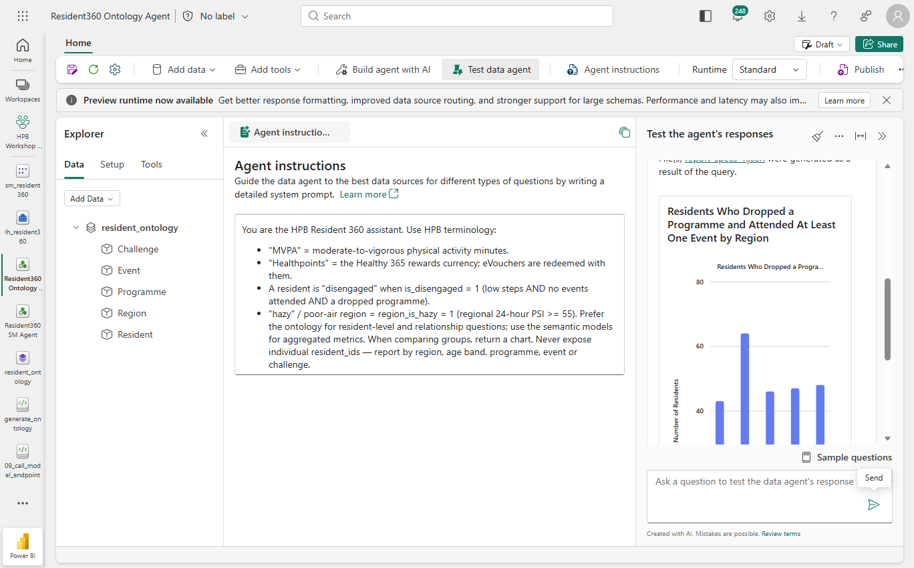
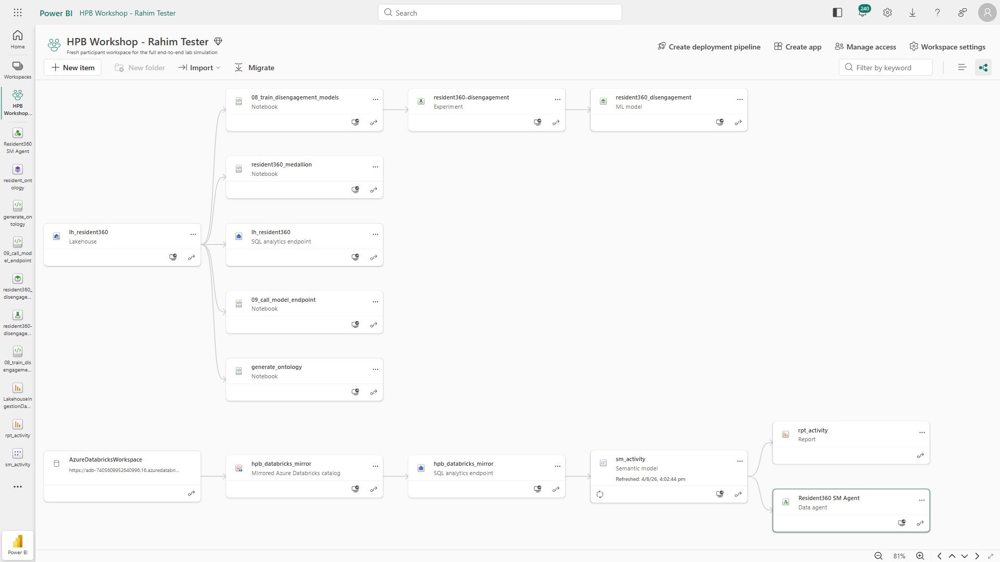

[← Workshop home](../README.md)

# Lab 4 · Just Ask
## Ontology + data agent — semantic model vs. ontology

**⏱ 45 min**  ·  **🎯 Focus:** #1 Data lineage (capstone)

### The story
HPB programme designers want to ask plain-English questions across Rahim's unified view. You'll **generate an ontology
from your data** (a notebook does the modelling), wire a **data agent** to it, and compare it against a semantic-model
agent over the same governed medallion data to see where each approach fits.

### You'll build
- An **ontology** (`resident_ontology`) — its blueprint **generated from your `gold`/`silver` data** by a notebook.
  **Resident** binds to **three** tables (profile + diet log + Healthpoints ledger) and **Region** to **two**
  (region attributes + event occurrences hosted) — the ontology reads several tables as one entity. Events are
  modelled at **occurrence** grain (`event_occurrence_id`), not base `event_id`, so repeated events in different
  dates/regions do not collapse together.
- Two data agents over the **same governed medallion data**: one on the **`sm_resident360`** semantic model, one on the **ontology**.
- A side-by-side **comparison** on a multi-hop question, plus **end-to-end lineage**.

### Where this fits

**Builds on:** the medallion + `sm_resident360` from Lab 1. This is the governed, conversational capstone. The
ontology uses Lab 1's event occurrence and attended-event mapping helper tables so attendance relationships are not
confused with mere bookings.

### Files
- `notebooks/generate_ontology.ipynb` — reads your data and prints the ontology **blueprint**.
- `assets/data_agent_questions.md` — the agent instructions + question bank.

> **New to Fabric?** Each step is small and self-contained — follow them in order.

---

### Task 1 — Generate the ontology blueprint from your data

1. Import **`generate_ontology.ipynb`** (workspace **Import → Notebook → From this computer**) and open it.
2. Attach the **`lh_resident360`** Lakehouse (Explorer → **Add data items → From OneLake catalog** → the Lakehouse).
3. Click **Run all**.
4. Read Section 1's output — the **entities** it found (Resident, Region, EventOccurrence, Programme, Challenge) with their keys and instance counts. Note the **multi-binding** entities: **Resident** lists **three** binding rows — a static profile (Timestamp = None) **plus two timeseries** (`silver.fact_meal_log`@`log_date` and `silver.fact_rewards`@`txn_date`) — and **Region** lists **two** (a static profile **plus** `silver.dim_event_occurrence`@`event_date`).
5. Read Section 2's output — the **relationships** it found (e.g. Resident —livesIn→ Region), with the exact key columns.
6. Scroll to Section 3 — the **blueprint** (two tables: entities and relationships). **Keep this on screen** for Task 2.

> **Quick self-check:** The blueprint should contain **5 entities** — Resident, Region, EventOccurrence,
> Programme, Challenge — and **5 relationships**: Resident —livesIn→ Region, Resident —attended→
> EventOccurrence, Resident —enrolledIn→ Programme, Resident —participatesIn→ Challenge, and
> EventOccurrence —heldIn→ Region.

> **Done when you see:** a printed blueprint listing the entities and the relationships with their mapping tables and `origin → target` keys — with **Resident** showing **two** extra timeseries binding rows and **Region** showing **one** (a date column in the Timestamp position).

---

> **This has been built end to end.** A reference ontology was built from this blueprint:
> **5 entity types, 8 data bindings** (5 static + 3 timeseries), **5 relationship types,
> 5 contextualizations**. The blueprint below is therefore known to be applyable, not merely
> designed. If your editor disagrees with a step here, trust this guide and tell the facilitator.
>
> ⚠️ **Creating an ontology also creates two hidden sibling items** — a `GraphModel` and a
> `Lakehouse` named `resident_ontology_graph_…` / `resident_ontology_lh_…`. That is expected;
> leave them alone. They are how the ontology graph is materialised.

### Task 2 — Create the ontology and apply the blueprint

You're not designing anything — simply applying the spec the notebook generated.

1. Workspace → **+ New item** → search **Ontology** → click **Ontology (preview)** → name it **`resident_ontology`** → **Create**.
2. If a welcome dialog appears, check **Don't show again** and close it.
3. **Add the entities.** For each row in the blueprint's *entities* table:
   1. Ribbon → **Add entity type** → name it (e.g. **Resident**).
   2. **Configure entity type → Add properties from data → Add data binding → Lakehouse table** → select the blueprint's **binding** table.
   3. Set the **key** to the blueprint's key column.
   4. In **Timeseries data**, set **Timestamp = None**.
   5. **Save**.
   6. **Multi-binding entities (Resident, Region).** The blueprint lists extra **timeseries** bindings for these. After the first (static) binding saves, stay on that entity → **Manage property bindings → Add binding and properties → Add data binding → Lakehouse table** → select the next table → the key auto-maps → in **Timeseries data** select the **date column** as **Timestamp** → **Save**. Repeat for each extra binding:
      - **Resident** (3 bindings total): add `silver.fact_meal_log` (Timestamp `log_date`), then `silver.fact_rewards` (Timestamp `txn_date`).
      - **Region** (2 bindings total): add `silver.dim_event_occurrence` (Timestamp `event_date`).

      The entity now reads a static profile **and** its timeseries as one entity.

   > ⚠️ **One non-timeseries binding only.** The first binding is non-timeseries (**Timestamp = None**). Every **additional** binding **must be timeseries** — the editor requires you to select a date column and disables **None** ("Only one non-timeseries binding is allowed per entity type"). A second static table (no date column) is rejected with *"The selected data source has no date/time columns."*
   > ⚠️ Bind **Lakehouse tables only** (the picker also offers Eventhouse).
   > ⚠️ **Duplicate columns:** if the second table repeats a column already bound (e.g. `resident_id`), the editor flags *"…already bound in another binding"* — click **Delete property binding** on that row in the second binding before Save.

4. **Add the relationships.** For each row in the blueprint's *relationships* table:
   1. Ribbon → **Add relationship** → set **name**, **origin**, **target** → **Create**.
   2. Click the new **edge** on the canvas → **Browse available sources** → select the blueprint's **mapping table**.
   3. Map the **origin key** and the **target key** exactly as the blueprint shows.
   4. **Verify both `Matched <Entity>` dropdowns** show the intended columns, then **Save**.

> **Done when you see:** the entity nodes joined by the named edges on the canvas (the editor auto-saves — no publish).

> **Editor tips (preview) — quick reference.** Bind **Lakehouse tables only** (the picker also offers Eventhouse). On the **first (static)** binding, set **Timestamp = None** *last*, right before Save — selecting the entity key can reset the Timestamp field to empty. The three flows:
>
> - **Entity · first binding:** Configure entity type → Add properties from data → Add data binding → Lakehouse table → select table → Define entity type key → set **Timestamp = None** → **Save**.
> - **Entity · extra timeseries binding:** Manage property bindings → Add binding and properties → Add data binding → Lakehouse table → select the table → select the **date column** as Timestamp → delete any duplicated column → **Save**.
> - **Relationship:** select an entity → Add relationship → name / origin / target → Create → View Relationship Type details → Browse available sources → select the mapping table → map both keys → **Save**.

---

### Task 2b — Refresh the graph (do not skip this)

Binding data to an ontology does **not** load it. The ontology has a hidden child
**graph model** that stores the instance graph, and it has to ingest your tables before
anything can query them. Skip this and Task 4's agent answers with
*"the graph query is failing on the backend"* — which looks like a broken agent but is an
empty graph.

1. Go back to your **workspace item list**.
2. Find the graph model created alongside your ontology — it is named
   **`resident_ontology_graph_<long id>`**. (A `resident_ontology_lh_…` Lakehouse is
   created too; leave both alone otherwise.)
3. On that row choose **⋯ (More options) → Schedule**.
4. Select **Refresh now**, and wait for it to finish before starting Task 4.

   > The same panel sets a recurring refresh. For the workshop a single manual refresh is
   > enough — your data is not changing underneath you.

   > **Why it is not automatic:** Fabric re-ingests automatically when the ontology
   > *schema* changes, but not when the *data* changes. Your bindings were added before the
   > rows existed as far as the graph is concerned, so it needs one explicit pass.

**Checkpoint:** the graph model's last refresh shows **Completed**.

---

### Task 3 — Build the semantic-model agent

1. Workspace → **+ New item → Data agent** → name **`Resident360 SM Agent`** → **Create**.
2. Toolbar → **Add data → Data source** → select **`sm_resident360`** (the Lab 1 model, built on the same `gold`/`silver` tables the ontology uses) → **Add**.
3. In the Explorer, check all six tables: **`resident_360`**, **`fact_event_attendance`**, **`fact_meal_log`**, **`fact_rewards`**, **`fact_programme_enrolment`**, **`fact_challenge`**.
4. Toolbar → **Agent instructions** → paste the instructions from `assets/data_agent_questions.md`.
   *(The instructions box is a **Markdown preview** — click it once to switch to edit mode, then paste.)*

---

### Task 4 — Build the ontology agent

1. Workspace → **+ New item → Data agent** → name **`Resident360 Ontology Agent`** → **Create**.
2. Toolbar → **Add data → Data source** → select **`resident_ontology`** → **Add** (added whole — no tables to check).
3. Toolbar → **Agent instructions** → paste the same instructions from `assets/data_agent_questions.md`.

---

### Task 5 — Semantic model vs. ontology, on the same data

> **What this comparison is, and is not.** Both agents read the same governed medallion data, so
> for a simple question — *"which regions have the highest share of disengaged residents?"* — they
> will agree, and they should. `gold.resident_360` is a wide table with `region` and
> `is_disengaged` on the same row; no join is needed and neither model has an advantage.
>
> The comparison earns its place on a question where **grain and relationship meaning** decide the
> answer. Three are built into this dataset:
>
> | Trap | The data |
> |---|---|
> | **Which region?** | ~18% of attended events (501 of 2,721) are held **outside** the resident's home region, so `livesIn` and `heldIn` give different answers |
> | **Attended or merely booked?** | 3,640 bookings vs **2,717** actual attendances — a 25% gap. The ontology's `attended` edge maps attended rows only |
> | **Which event?** | 10 `event_id` values vs **~2,510** `event_occurrence_id` values. Grouping by the series instead of the occurrence collapses 251 occurrences into one |
>
> Ask Q1 of both agents, then look at *how* each answered — which `region` column or which edge it
> used — rather than only at the numbers.
>
> **Observed on a reference run** (your run may differ — agent behaviour changes with model
> updates, so validate rather than quote this):
>
> | | `Resident360 SM Agent` | `Resident360 Ontology Agent` |
> |---|---|---|
> | *Disengaged residents by region* (single table) | correct, with a chart, 30 s | correct, 37 s |
> | **Q1, three hops, held-in region** | *"There's content here I can't work with."* 39 s | **Central 95 · West 57 · North 52 · North-East 51 · East 51**, 11 s |
>
> Both answers to Q1 were checked against SQL. The ontology agent matched on every region. The
> semantic-model agent did not fail because it is worse — it failed because the question asks for a
> traversal (`enrolledIn` → `attended` → `heldIn`) that a star schema has no way to name. That is
> the whole point of the lab, and it is why the simple question is asked first: on that one, both
> agents agree, and they should.

Both agents now read the **same governed medallion data** — the SM agent through the `sm_resident360` star schema,
while the ontology agent traverses the `resident_ontology` graph and its Lab 1 helper tables for event occurrence and
actual attendance. Ask each the **same multi-hop question** and compare *how* each answers.

1. Ask **both** agents:

   > *"Among residents who dropped a programme, how many attended at least one event, broken down by the region where those events were held? Return a chart by region."*

   This spans three domains — programme enrolment, event attendance, and the event's region.

2. Read the **SM agent's** answer. It should plan a query over the star schema (joining the facts through `resident_360` on `resident_id` and filtering `attended_flag = "Y"`) and return a chart. Treat the query/results shown in your run as authoritative, not the screenshot.

   

3. Read the **Ontology agent's** answer. It **traverses named relationships** — Resident —enrolledIn→ Programme and Resident —attended→ EventOccurrence —heldIn→ Region. The `attended` relationship maps only rows from `silver.map_resident_event_attendance`, so bookings that were not attended are not counted as attendance. The point here is the *explicit, named path* (no guessing which `region` column to join) — **not** a guarantee of a matching number. The ontology item is in **preview** and its data agent plans queries non-deterministically, so validate the numbers against the semantic-model query and the chart produced in your own run.

   

4. Try 2–3 more questions from the bank on both agents and **generate a visual** for each.

> **What this shows.** On a clean star schema, the semantic model gives you the classic BI validation path. The **ontology's value is architectural**, not a different (or guaranteed-identical) number:
> - **Named, typed relationships** — `livesIn` (a resident's home region), `attended` (actual attended event occurrences), and `heldIn` (an event occurrence's region) are *distinct* edges, so multi-hop questions are unambiguous instead of relying on the agent to guess which `region` column to join.
> - **Graph-native traversal** — deep or variable-length paths across entities are first-class, not hand-built joins.
> - **A governed, reusable semantic layer** — one ontology can back many agents and apps.
>
> **Rule of thumb:** reach for the **semantic model** for classic BI metrics and dashboards; reach for the **ontology** when relationships, multi-hop traversal, and reuse across agents matter.

> **Note:** a multi-hop answer takes ~30–90 sec on either agent (plan → query → chart). Both report by group, never by individual `resident_id`.

---

### Task 6 — End-to-end lineage

1. In the workspace, switch to **Lineage view**.
2. Trace one artifact back through the graph — from an agent/report to the semantic model, to `gold.resident_360`, to `silver`/`bronze`, to the mirrored Databricks tables. *(Read the actual graph on screen — it's your authoritative lineage.)*

   

3. Right-click a mirrored table → **Impact analysis** ("if this changes, what breaks?").
4. **Endorse** a semantic model: **⋯ (More options) → Settings → Endorsement and discovery → Promoted → Apply**.

---

### ✅ Checkpoint
- [ ] Ran the generator notebook → got the blueprint
- [ ] `resident_ontology` built from the blueprint (Resident with 3 bindings, Region with 2, + 5 relationships)
- [ ] Two agents built over the same governed medallion data (`sm_resident360` and the ontology)
- [ ] Asked both the same multi-hop question and compared how each answers
- [ ] Lineage traced; a model endorsed

---

### Next up
**Wrap-up & next steps**
